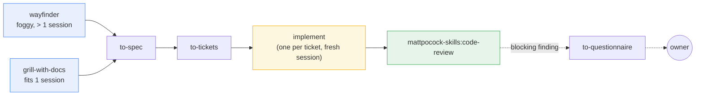
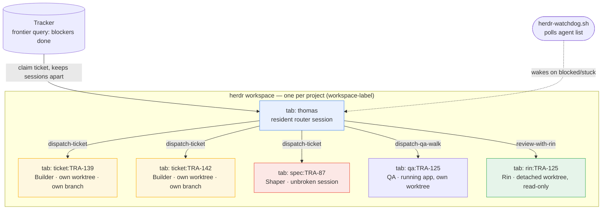
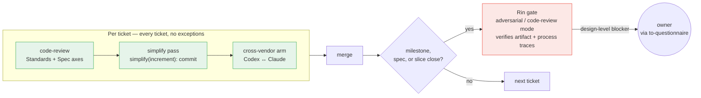

# Astraler Harness 2.2.17

An operating framework that lets **several AI agents build software together on an existing
codebase** — without colliding, without drifting, and without losing the thread.

## Why this exists

[Matt Pocock's `mattpocock-skills` plugin](https://github.com/mattpocock/skills) gives one
agent a complete engineering method: spec, tickets, implement, review. But two gaps remain
when you move from a solo greenfield session to a team working on a real codebase:

1. **Brownfield.** The plugin's skills assume a clean starting point. Real projects have
   legacy code, missing tests, tangled modules, and inherited backlogs.
2. **Concurrency.** One agent, one session, one repo. Scale that to several agents working
   the same frontier and they overwrite each other.

This package closes both gaps. Everything here earns its place against that sentence — a rule
that serves one engineer on a clean repo belongs upstream, and stays there.

## How it works

### The spine

The engineering method comes from the plugin. Work enters through one of two doors:

- **`wayfinder`** — for foggy efforts larger than one session
- **`grill-with-docs`** — for anything that fits one session

Both converge into: **`to-spec`** → **`to-tickets`** → one **`implement`** per ticket →
**`code-review`**.



Every agent also reaches the craft layer directly — `grilling`, `tdd`,
`mattpocock-skills:code-review`, `codebase-design`, `domain-modeling`, `research`,
`prototype`, `diagnosing-bugs`, `wizard`, `resolving-merge-conflicts`. Installing the plugin
once equips the whole team.

### Five roles, each with a clear boundary

Roles follow session boundaries, because the plugin fixes those boundaries.

| Role | Session | What it does |
|---|---|---|
| **Thomas** — router | resident | Triage, wayfinder, questionnaire routing; owns the tracker, the frontier, merge, and fires the cross-vendor arm |
| **Shaper** | one unbroken session | `grill-with-docs` → `to-spec` → `to-tickets`; decides seams while the whole picture is in context |
| **Builder** | one per ticket | `implement`, in its own worktree — sole writer there |
| **Rin** — reviewer | per milestone | Second opinion, artifact verification; owns the review standard |
| **QA** | per walk | Exercises the RUNNING product — interface, journeys, API contracts, data as experienced |

### Coordination: tracker + worktree isolation

**The tracker is the coordination substrate.** Work state lives on the tracker configured by
the plugin's `setup-matt-pocock-skills`. Blocking edges give the dependency graph; the
frontier query — every ticket whose blockers are done — answers what is ready. Assigning a
ticket before starting it is the claim that keeps concurrent sessions apart.

**This package extends that claim to build tickets.** A claimed build ticket gets its own
git worktree and its own terminal pane, so several Builders work the frontier at once. That
is the throughput mechanism, and `dispatch-ticket` is where it lives.



Several Builders sit in the same workspace but never the same worktree — that is what lets
them work the frontier concurrently without colliding.

### Review: weight without the loop

Every ticket passes three review layers before it can merge — no exceptions:

1. **`mattpocock-skills:code-review`** — Standards + Spec axes in one pass
2. **Simplify pass** — per-increment, leaving a `simplify(increment):` marker commit
3. **Cross-vendor arm** — Codex reviews Claude's work (or vice versa)



At milestones, spec finalization, and slice close: Rin runs a gate — verifying the artifact
and that the process left its traces. A design-level blocking finding escalates to the owner
through `to-questionnaire` rather than spawning another review round.

**Answers carry a source.** Agents resolve the Align frontier themselves — from the codebase,
a prior ADR, `research`, `prototype`, or a second opinion — and record which. An answer with
no source leaves the question open.

### Brownfield: this package's half

The plugin contains no mention of *legacy*, *brownfield*, *characterisation* or *untestable*.
The projects this harness installs into are not greenfield, so four skills close the gap:

**Bootstrap skills** — invoked by name, once per repo, each producing an artifact the owner
reviews. Thomas owns these.

| Skill | Produces |
|---|---|
| `bootstrap-glossary` | `CONTEXT.md`, seeded from code, every term citing its source file |
| `batch-triage` | an inherited backlog as tickets with labels and blocking edges |

**Craft skills** — model-invoked, reached when the situation arises, like `tdd` and
`mattpocock-skills:code-review`.

| Skill | Reached when |
|---|---|
| `legacy-testing` | the code to change has no seam, so `tdd` cannot attach |
| `untangle` | a refactor is too tangled for `improve-codebase-architecture` |

The rule for all of them: **extract, never invent** — a standard the code does not follow,
or a glossary term nobody confirmed, becomes confident-sounding lore that later sessions
treat as truth.

## Requirements

Run the doctor to check machine and repo readiness:

```bash
./check-requirements.sh                 # machine readiness only
./check-requirements.sh <target-repo>   # machine + that repo's readiness
```

### Machine requirements

| Requirement | Required | Notes |
|---|---|---|
| Claude Code CLI | yes | The root runtime; Rin's gate cannot run without it |
| Git with worktree support | yes | Each Builder works in its own worktree |
| [herdr](https://github.com/AstralEr/herdr) ≥ 0.8.0 | yes | Terminal multiplexer for agent panes |
| `mattpocock-skills` plugin | yes | The engineering method — the spine |
| Codex CLI | optional | Cross-vendor arm; degrades to a warning when absent |
| OpenCode | optional | Third provider; roles dispatch to it when `orchestrator.md` assigns them |

### Target repo requirements

The target repo needs its tracker and triage labels configured. The doctor names what is
missing and how to fix it.

## Installation

Installation is a two-phase process: a mechanical staging step (safe, repeatable) followed
by a semantic adaptation step (agent-driven, project-aware).

### Phase 1: Stage the release

```bash
./install.sh <target-repo-path>
# optionally: ./install.sh <target-repo-path> --project-name "My Project"
```

This copies the harness payload into `<target>/.astraler/releases/<version>/` and nothing
else. No project files are changed. The staging is **idempotent** (rerunning does nothing)
and **immutable** (a staged release is a fixed record of what was shipped).

### Phase 2: Adapt into the project

Open a Claude Code (or Codex) session in the target repo and give it this instruction:

```
Read .astraler/releases/<version>/ADAPT-HARNESS.md completely and execute it.
```

The adaptation agent will:
1. Inspect the project — structure, dependencies, existing configuration
2. Compare against any previously applied release (for upgrades)
3. Integrate the harness into the project's agent and skill configuration
4. Ensure the `mattpocock-skills` plugin is installed and its setup step has run
5. Verify the result **by artifact** and record the applied version

### Phase 3: Configure the orchestrator

After adaptation, edit `.agents/orchestrator.md` in your project. This is **your file** — no
upgrade will ever overwrite it. Set:

1. **`workspace-label`** — your project's herdr workspace name
2. **Model IDs** — which model each role uses on each runtime
3. **Fallback providers** — optional Codex/OpenCode rows for degraded dispatch

Then start Thomas:

```bash
claude --agent thomas
```

## Vocabulary

Four words do most of the work, and two of them are easy to swap by accident.

| Word | Means |
|---|---|
| **package** | this repo — the thing that produces a harness |
| **adapted project** | a repo the harness was installed into |
| **payload** | what a release stages into a project and may overwrite freely |
| **scaffold** | the owner's values, written once and never overwritten: `.agents/orchestrator.md` and `.codex/profiles/*` |

`scaffold` is a property of a few files inside the payload, not a name for the package — a
release can repair payload in every project it reaches and can never repair scaffold in any
of them.

## Layout

```text
harness/                          the payload staged into a target repo
  .agents/
    roles/                        five contracts + per-runtime supplements
      builder.md                    base contract
      builder-claude.md             simplify phase (Skill tool), /compact, /clear
      builder-codex.md              simplify SKIPPED protocol
      builder-opencode.md           simplify SKIPPED protocol
      thomas.md · thomas-{claude,codex,opencode}.md
      rin.md · rin-{claude,codex,opencode}.md
      shaper.md · qa.md             runtime-neutral, no supplements
    orchestrator.md               role → runtime/model/effort + workspace/tab identity;
                                  the owner's file
    skills/
      dispatch-ticket/            shared protocol — binding, worktree, brief, review
      dispatch-ticket-claude/     Claude launcher + verification
      dispatch-ticket-codex/      Codex launcher + verification
      dispatch-ticket-opencode/   OpenCode launcher + verification
      codex-claude-arm/           cross-vendor arm, Codex root → Claude
      review-with-rin/            ┐
      dispatch-qa-walk/           │ copies for Codex/OpenCode discovery
      codex-arm/                  │ (Claude originals in .claude/skills/ untouched)
      batch-triage/               │
      bootstrap-glossary/         │
      legacy-testing/             │
      untangle/                   │
      reconcile-tracker/          ┘ tracker ↔ git drift check, bound at merge + session start
  .claude/
    agents/                       Claude adapters so --agent <role> resolves
    skills/                       Claude-discovered skills (13 skills)
  .opencode/
    agents/                       OpenCode adapters so --agent <role> resolves
  .codex/profiles/                one per role, mirroring the orchestrator rows
  .agents/memory/
    recurring-failure-modes.md    88 measured failure modes; append-only, the evidence base
  scripts/
    herdr-watch-terminal.sh       turn watcher with a real start guard
    herdr-watchdog.sh             background poll of herdr agent list; wakes Thomas on
                                  a blocked/stuck pane during autonomous dispatch
    ticket-git-facts.sh           git half of reconcile-tracker; no network, decides nothing
    docs-staleness-audit.sh       always-on word budgets, and numbers docs state about themselves
    check-reachability.sh         eight checks: does the method the docs describe
                                  exist, is it reachable, and is it addressed correctly?
    check-requirements.sh         the doctor, vendored into the adapted project
docs/adr/0001-…                   why the method was rebuilt around the plugin
prompts/ADAPT-HARNESS.md          the semantic installer the agent executes
install.sh                        mechanical staging, immutable releases
check-requirements.sh             the doctor
```

## Why the failure-mode ledger is here

`recurring-failure-modes.md` carries 88 measured failure modes. It is the evidence base: a
rule kept in this package can point at an entry there; a rule that cannot point at one is a
rule to re-examine. That is the test 1.0.0 applied to everything it carried over, and it is
why this package is smaller than the one it replaces.

## Writing rules

Every document here is written under `writing-for-agents` from the plugin, with four
measured targets:

- **Prohibition density.** The prior package ran one prohibition every 24 words in its
  reviewer contract, against upstream's one per 155. Prohibition makes the forbidden
  behaviour more available, so the positive target gets phrased and a prohibition survives
  only as a guardrail that resists positive phrasing — paired with the positive.
- **No-ops get hunted.** An instruction the model already follows by default costs load and
  buys nothing. Settle it by running the document; when a sentence fails, remove it.
- **Branching is the disclosure test.** Inline what every branch needs; put behind a pointer
  what only some branches reach.
- **One home per rule.** Everywhere else links. The prior package restated its gate law in
  five places and they drifted apart.
