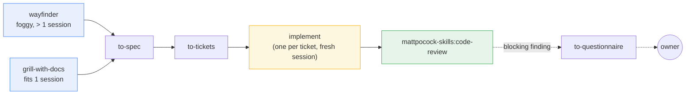
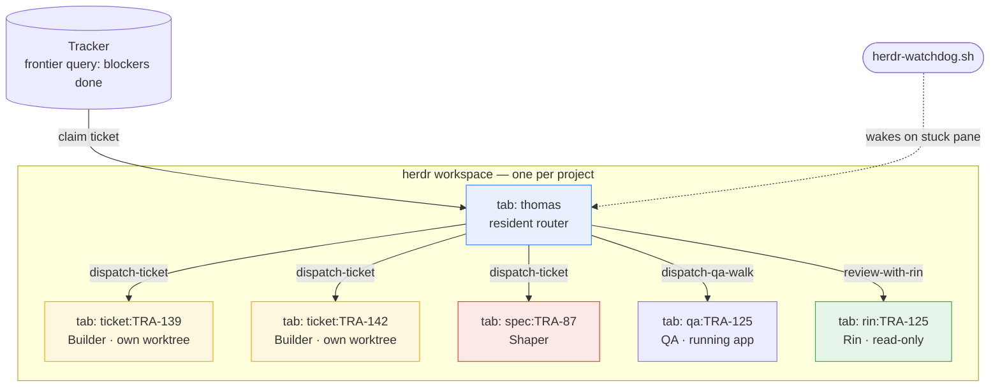
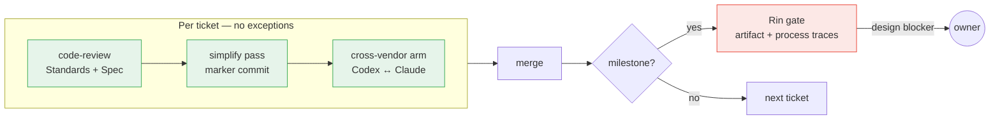

# Astragentic 2.2.38

**Agent orchestration framework and operating harness** for multi-agent software development.

Astragentic coordinates several AI agents building software together on an existing
codebase. The orchestration decides *who works on what, where, and on which runtime*. The
harness holds the contracts, the review gates, and the 98 measured failure modes that shaped
every rule in this system.

---

## The problem

AI coding agents are powerful individually. But the moment you try to scale — multiple
agents, real codebase, concurrent work — things fall apart in predictable ways.

### Agents collide

Two agents sharing a checkout: one runs `git switch` while the other is committing. Three
commits land on the wrong branch and vanish. No isolation boundary means no concurrency.

### Reviews loop forever

A prior system measured 5-14 review rounds per plan. Round 2 added a lock, round 3 cut it,
round 8 was still cleaning up round 2's leftovers. The exit condition — zero findings — was
held by the reviewer, who always controls it. Most of the later rounds were the loop cleaning
up after itself.

### Brownfield is invisible

The best agent skills assume a clean starting point. They contain no mention of *legacy*,
*brownfield*, *characterisation* or *untestable*. Point a code-review's Standards axis at a
repo with no written standards and it silently becomes the thing it was built to prevent — a
generic review with no anchor.

### Silent degradation

A substitute tool producing the same marker passes every automated check. A summary claiming
findings were folded while the text was untouched — caught only because a human happened to
be watching the pane. Three consecutive spec gates ran unseen while owner-scale decisions
were made inside them.

### Nobody knows what actually ran

An agent reports "done" — but did it run the simplify pass, or skip it? Did it use the
sanctioned tool, or fall back to something that leaves the same commit marker? Without
provenance in the artifact, every check reads green by construction.

---

## How Astragentic solves this

### 1. Worktree isolation: agents that cannot collide

Each Builder gets its own git worktree and its own terminal pane. They share a frontier but
never a checkout. One project, one workspace, several Builders — concurrent by design,
isolated by construction.

### 2. One review round, three layers deep

No loops. Every ticket passes three review layers before it can merge — once each, no
exceptions:

1. **Code review** — `mattpocock-skills:code-review`, Standards + Spec axes in one pass
2. **Simplify pass** — `Skill(skill: "simplify")`, leaving a marker commit with provenance
3. **Cross-vendor arm** — a different AI provider reviews the work (Codex reviews Claude, or
   vice versa)

At milestones: **Rin's gate** — adversarial or code-review mode, verifying the artifact and
that the process left its traces. A design-level finding goes to the owner, not to another
round.

Prior system: 5-14 rounds. This system: 1 round per milestone.

### 3. Brownfield-native

Four skills close the gaps that upstream leaves open:

| Skill | What it does |
|---|---|
| `bootstrap-glossary` | Seeds `CONTEXT.md` from code — every term cites its source file |
| `batch-triage` | Converts an inherited backlog into tickets with labels and blocking edges |
| `legacy-testing` | Characterisation tests + seam creation for untested code |
| `untangle` | Refactor path for code too tangled for `improve-codebase-architecture` |

The rule: **extract, never invent**. A standard the code does not follow, or a glossary term
nobody confirmed, becomes confident-sounding lore that later sessions treat as truth.

### 4. Provenance in every artifact

Every commit carries a `Pass:` line naming *what actually ran* — not what was supposed to.
Every answer carries a source — codebase, ADR, research, prototype, or second opinion. Gate
reports are written outside every checkout with token-unique paths. Merge commits carry a
`Ledger:` line. A summary without evidence is not accepted as proof.

### 5. 98 measured failure modes

Every rule in this system can point at an entry in `recurring-failure-modes.md`. A rule that
cannot point at one is a rule to re-examine. The ledger is append-only — a lesson that later
proved wrong is marked `superseded` in place, never deleted. That is the test 1.0.0 applied
to everything it carried over, and it is why this package is smaller than the one it
replaces.

---

## The method

### The spine: Matt Pocock's skills

[Matt Pocock's `mattpocock-skills` plugin](https://github.com/mattpocock/skills) supplies
the engineering method one agent follows. Astragentic wraps it with orchestration and
extends it to brownfield.

Work enters through one of two doors:

- **`wayfinder`** — foggy efforts larger than one session
- **`grill-with-docs`** — anything that fits one session

Both converge into: **`to-spec`** → **`to-tickets`** → one **`implement`** per ticket →
**`code-review`**.



Every agent also reaches the craft layer directly — `grilling`, `tdd`, `codebase-design`,
`domain-modeling`, `research`, `prototype`, `diagnosing-bugs`, `wizard`,
`resolving-merge-conflicts`. Installing the plugin once equips the whole team.

### Five roles

| Role | Session | Responsibility |
|---|---|---|
| **Thomas** — router | resident | Triage, frontier, merge, dispatch, cross-vendor arm, watchdog |
| **Shaper** | one unbroken session | `grill-with-docs` → `to-spec` → `to-tickets`; decides seams while the whole picture is in context |
| **Builder** | one per ticket | `implement` in its own worktree — sole writer there |
| **Rin** — reviewer | per milestone | Adversarial or code-review gate; artifact + process verification |
| **QA** | per walk | Exercises the RUNNING product — interface, journeys, API contracts, data as experienced |

### Orchestration topology



### Review pipeline



---

## Tech stack

### Required

| Component | Role in the system |
|---|---|
| [**Claude Code CLI**](https://docs.anthropic.com/en/docs/claude-code) | Root runtime. Every role can run here. Rin's gate requires it |
| **Git** (with worktree support) | Isolation boundary — one worktree per Builder, one branch per ticket |
| [**herdr**](https://github.com/AstralEr/herdr) ≥ 0.8.0 | Terminal workspace manager. Agent panes, prompt/wait/read, workspace topology |
| [**mattpocock-skills**](https://github.com/mattpocock/skills) plugin ≥ 1.2.3 | The engineering method spine — wayfinder, grill, spec, tickets, implement, code-review |

### Optional

| Component | What it adds | Without it |
|---|---|---|
| **Codex CLI** | Cross-vendor arm — a second AI provider reviews every ticket | Single-provider mode; arm records `NOT RUN` |
| **OpenCode CLI** | Third runtime option; roles dispatch to it via `orchestrator.md` | Two-runtime system (Claude + Codex) |

### Target repo needs

The doctor (`check-requirements.sh`) checks everything and names what is missing:

- Tracker configuration (`docs/agents/issue-tracker.md`, triage labels)
- Git worktree support
- Payload committed to HEAD (uncommitted contracts are invisible in worktrees)

---

## Installation

Three phases: stage, adapt, configure.

### Phase 1 — Stage the release

```bash
./check-requirements.sh                      # verify machine readiness
./install.sh <target-repo>                   # stage the release
# optionally: ./install.sh <target-repo> --project-name "My Project"
```

This copies the harness into `<target>/.astraler/releases/<version>/`. No project files are
touched. The staging is **idempotent** (rerunning does nothing) and **immutable** (a staged
release is a fixed record of what was shipped).

### Phase 2 — Adapt into the project

Open a Claude Code or Codex session in the target repo:

```
Read .astraler/releases/<version>/ADAPT-HARNESS.md completely and execute it.
```

The adaptation agent:
1. Reads the release notes for this version's intent and breaking changes
2. Inspects the project — structure, dependencies, existing configuration
3. Compares against any previously applied release (three-way for upgrades)
4. Confirms `mattpocock-skills` is installed; asks the owner to run its setup step
5. Integrates the harness — role contracts, skills, adapters, scripts
6. Runs brownfield bootstrap if this is a first install (glossary, backlog triage)
7. **Verifies by artifact** — git diff, bash syntax, requirements check, reachability check
8. Records the applied version and writes an adaptation report

### Phase 3 — Configure and start

Edit `.agents/orchestrator.md` — **your file**, never overwritten by an upgrade:

```markdown
## Workspace identity
| Field | Value |
|---|---|
| workspace-label | `my-project` |       ← your herdr workspace name

## Active assignments
| Role    | Runtime | Model           | Effort |
|---------|---------|-----------------|--------|
| thomas  | claude  | claude-opus-5   | medium |
| shaper  | claude  | claude-opus-5   | high   |
| builder | claude  | claude-sonnet-5 | medium |
| rin     | claude  | claude-opus-5   | medium |
| qa      | claude  | claude-sonnet-5 | low    |
```

Then start:

```bash
claude --agent thomas
```

Thomas reads the orchestrator, claims the workspace, and begins routing work.

---

## At a glance

| | |
|---|---|
| **Roles** | 5 — Thomas, Shaper, Builder, Rin, QA |
| **Skills** | 13+ Claude-discovered, 4 brownfield-specific |
| **Runtimes** | 3 — Claude Code, Codex, OpenCode |
| **Review layers per ticket** | 3 — code-review, simplify, cross-vendor arm |
| **Review rounds per milestone** | 1 (prior system: 5-14) |
| **Measured failure modes** | 98 entries, append-only evidence base |
| **Isolation** | 1 worktree per Builder, 1 branch per ticket |

---

## Layout

```text
harness/                          payload staged into a target repo
  .agents/
    roles/                        five role contracts + per-runtime supplements
    orchestrator.md               role → runtime/model/effort (owner's file)
    skills/                       13+ skills for dispatch, review, brownfield, arm
    memory/
      recurring-failure-modes.md  98 failure modes — the evidence base
  .claude/
    agents/                       Claude adapters (--agent <role>)
    skills/                       Claude-discovered skills
  .opencode/agents/               OpenCode adapters
  .codex/profiles/                Codex role profiles
  scripts/
    herdr-watch-terminal.sh       turn watcher for dispatched panes
    herdr-watchdog.sh             background poll, wakes Thomas on stuck panes
    ticket-git-facts.sh           git state for tracker reconciliation
    docs-staleness-audit.sh       word budgets, self-reported numbers
    check-reachability.sh         8 checks: method exists, reachable, addressed
    check-requirements.sh         the doctor (also vendored into adapted projects)
docs/adr/0001-…                   why the method was rebuilt around the plugin
prompts/ADAPT-HARNESS.md          the semantic installer
install.sh                        mechanical staging
check-requirements.sh             the doctor
```

## Vocabulary

| Word | Means |
|---|---|
| **package** | this repo — the thing that produces a harness |
| **adapted project** | a repo the harness was installed into |
| **payload** | what a release stages and may overwrite freely |
| **scaffold** | the owner's values, written once, never overwritten (`orchestrator.md`, `.codex/profiles/*`) |
