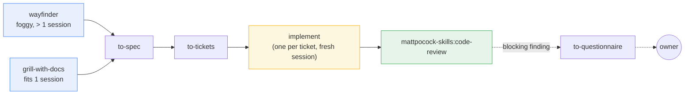
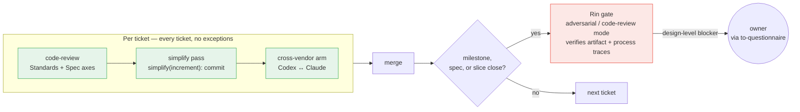

# Astraler Harness 2.2.10

An operating framework that lets **several agents build software together on an existing
codebase**.

[Matt Pocock's `mattpocock-skills` plugin](https://github.com/mattpocock/skills) supplies the
method one engineer follows. This package supplies the two things that method leaves open:
**working on code that already exists**, and **many agents working at once without
colliding**.

Everything here earns its place against that sentence. A rule that serves one engineer on a
clean repo belongs upstream, and stays there.

## Requirements

```bash
./check-requirements.sh                 # machine readiness
./check-requirements.sh <target-repo>   # machine + that repo's readiness
```

The machine needs the Claude Code CLI, git with worktree support, herdr ≥ 0.8.0, and the
`mattpocock-skills` plugin. Codex is the cross-vendor arm and degrades to a warning when
absent. OpenCode is an optional third provider — roles can be dispatched to it when
`orchestrator.md` assigns them there. The target repo needs its tracker and triage labels
configured — the doctor names what is missing and how to produce it.

## The method

**The spine comes from the plugin.** A foggy effort larger than one session enters at
`wayfinder`; anything that fits one session enters at `grill-with-docs`. Both hand off to
`to-spec` → `to-tickets` → one `implement` per ticket → `mattpocock-skills:code-review`.

**Roles follow session boundaries**, because the plugin fixes those boundaries: align, spec
and tickets run in one unbroken context, and each `implement` runs in a fresh one.

| Role | Session | Drives |
|---|---|---|
| **Thomas** — router | resident | `triage`, `wayfinder`, `to-questionnaire`, `ask-matt`; owns the tracker, the frontier and merge; fires the arm |
| **Shaper** | one unbroken session | `grill-with-docs` → `to-spec` → `to-tickets`; decides seams while the whole picture is in context |
| **Builder** | one per ticket | `implement`, in its own worktree, sole writer there |
| **Rin** — reviewer | per milestone | second opinion, artifact verification; owns the arm's standard |
| **QA** | per walk | exercises the RUNNING product — interface, journeys, API contracts, data as experienced |



Every agent reaches the craft layer directly, since those skills are model-invoked:
`grilling`, `tdd`, `mattpocock-skills:code-review`, `codebase-design`, `domain-modeling`, `research`,
`prototype`, `diagnosing-bugs`, `wizard`, `resolving-merge-conflicts`. Installing the plugin
once equips the whole team.

**The tracker is the coordination substrate.** Work state lives on the tracker configured by
`setup-matt-pocock-skills` behind `docs/agents/issue-tracker.md`. Blocking edges give the
dependency graph; the frontier query — every ticket whose blockers are done — answers what
is ready; and assigning a ticket before starting it is the claim that keeps concurrent
sessions apart.

**This package extends the claim to build tickets.** Upstream applies assignee-as-lock to
decision tickets and builds one ticket per session. Here a claimed build ticket gets its own
worktree and pane, so several Builders work the frontier at once under the isolation rules
carried over from the prior package. That is the throughput mechanism, and
`dispatch-ticket` is where it lives.

**Each project resolves to exactly one herdr workspace.** `orchestrator.md` carries the
`workspace-label`; Thomas matches or creates that workspace before any dispatch, and every
dispatched pane lands in a tab named by role — `ticket:<id>`, `spec:<id>`, `qa:<id>`,
`rin:<id>` — so owner-created tabs are never split into, renamed or closed. A background
watchdog, `herdr-watchdog.sh`, can poll that workspace during autonomous dispatch and wake
Thomas on a blocked or stalled pane.


Several Builders sit in the same workspace but never the same worktree — that is what lets
them work the frontier concurrently without colliding.

**Review keeps its weight and drops the loop.** Per ticket: `mattpocock-skills:code-review`'s two axes in one
pass, a per-increment simplify pass leaving a `simplify(increment):` marker commit, and the
cross-vendor arm before the merge — no ticket merges without one. At a milestone: one Rin
round, verifying the artifact and that the process left its traces. Once more at the spec,
before tickets are cut, and once over the slice when it closes. A design-level blocking
finding escalates to the owner through `to-questionnaire` rather than to another round.



**Answers carry a source.** Agents resolve the Align frontier themselves, answering from the
codebase, a prior ADR, `research`, `prototype`, or a second opinion — and recording which. An
answer with no source leaves the question open.

## Brownfield is this package's half

Upstream's skills contain no occurrence of *legacy*, *brownfield*, *characterisation* or
*untestable*; its brownfield notes live on its docs site for human readers. The projects this
package installs into are not greenfield, so four gaps are ours. The rule for all six is
**extract, never invent** — a standard the code does not follow, or a glossary term nobody
confirmed, becomes confident-sounding lore that later sessions treat as truth.

They split by how they are reached, and the split is deliberate:

**Bootstrap — invoked by name, once per repo, each producing an artifact the owner reviews.**
Thomas owns all three as phases in his contract, so they cannot become work that everyone
assumes someone else ran.

| Skill | Produces |
|---|---|
| `bootstrap-glossary` | `CONTEXT.md`, seeded from code, every term citing its source file |
| `batch-triage` | an inherited backlog as tickets with labels and blocking edges |

**Craft — model-invoked, reached when the situation arises**, needing no wiring, exactly like
`tdd` and `mattpocock-skills:code-review`.

| Skill | Reached when |
|---|---|
| `legacy-testing` | the code to change has no seam, so `tdd` cannot attach |
| `untangle` | a refactor is too tangled for `improve-codebase-architecture` |

## Vocabulary

Four words do most of the work, and two of them are easy to swap by accident.

| Word | Means |
|---|---|
| **package** | this repo — the thing that produces a harness. Payload sits under `harness/` |
| **adapted project** | a repo the harness was installed into. Payload sits at the repo root |
| **payload** | what a release stages into a project and may overwrite freely |
| **scaffold** | the owner's values, written once and never overwritten: `.agents/orchestrator.md` and `.codex/profiles/*` |

Both scripts detect which of the two layouts they are running in and say so, so the layout is
the machine test for package versus adapted project. **`scaffold` is a property of a few files
inside the payload, not a name for the package** — a release can repair payload in every
project it reaches and can never repair scaffold in any of them, which is why a guard against
scaffold drift has to live in payload.

`CONTEXT.md` is not in this list on purpose: the harness already owns that name for a
project's domain glossary, seeded by `bootstrap-glossary`.

## Layout

```text
harness/                          the payload staged into a target repo
  .agents/
    roles/                        five contracts + per-runtime supplements
      builder.md                    base contract
      builder-claude.md             simplify phase (Skill tool), /compact, /clear
      builder-codex.md              simplify SKIPPED protocol
      builder-opencode.md           simplify SKIPPED protocol
      thomas.md · thomas-{claude,codex,opencode}.md
      rin.md · rin-{claude,codex,opencode}.md
      shaper.md · qa.md             runtime-neutral, no supplements
    orchestrator.md               role → runtime/model/effort + workspace/tab identity;
                                  the owner's file
    skills/
      dispatch-ticket/            shared protocol — binding, worktree, brief, review
      dispatch-ticket-claude/     Claude launcher + verification
      dispatch-ticket-codex/      Codex launcher + verification
      dispatch-ticket-opencode/   OpenCode launcher + verification
      codex-claude-arm/           cross-vendor arm, Codex root → Claude
      review-with-rin/            ┐
      dispatch-qa-walk/           │ copies for Codex/OpenCode discovery
      codex-arm/                  │ (Claude originals in .claude/skills/ untouched)
      batch-triage/               │
      bootstrap-glossary/         │
      legacy-testing/             │
      untangle/                   │
      reconcile-tracker/          ┘ tracker ↔ git drift check, bound at merge + session start
  .claude/
    agents/                       Claude adapters so --agent <role> resolves
    skills/                       Claude-discovered skills (13 skills)
  .opencode/
    agents/                       OpenCode adapters so --agent <role> resolves
  .codex/profiles/                one per role, mirroring the orchestrator rows
  .agents/memory/
    recurring-failure-modes.md    78 measured failure modes; append-only, the evidence base
  scripts/
    herdr-watch-terminal.sh       turn watcher with a real start guard
    herdr-watchdog.sh             background poll of `herdr agent list`; wakes Thomas on a
                                  blocked/stuck pane during autonomous dispatch
    ticket-git-facts.sh           git half of reconcile-tracker; no network, decides nothing
    docs-staleness-audit.sh       always-on word budgets, and numbers docs state about themselves
    check-reachability.sh         eight checks: does the method the docs describe
                                  exist, is it reachable, and is it addressed correctly?
docs/adr/0001-…                   why the method was rebuilt around the plugin
prompts/ADAPT-HARNESS.md          the semantic installer the agent executes
install.sh                        mechanical staging, immutable releases
check-requirements.sh             the doctor
```

## Why the failure-mode ledger is here

It is the evidence base. A rule kept in this package can point at an entry in
`recurring-failure-modes.md`; a rule that cannot point at one is a rule to re-examine. That
is the test 1.0.0 applied to everything it carried over, and it is why this package is
smaller than the one it replaces.

## Writing rules

Every document here is written under `writing-for-agents` from the plugin, with four
measured targets:

- **Prohibition density.** The prior package ran one prohibition every 24 words in its
  reviewer contract, against upstream's one per 155. Prohibition makes the forbidden
  behaviour more available, so the positive target gets phrased and a prohibition survives
  only as a guardrail that resists positive phrasing — paired with the positive.
- **No-ops get hunted.** An instruction the model already follows by default costs load and
  buys nothing. Settle it by running the document; when a sentence fails, remove it.
- **Branching is the disclosure test.** Inline what every branch needs; put behind a pointer
  what only some branches reach.
- **One home per rule.** Everywhere else links. The prior package restated its gate law in
  five places and they drifted apart.
