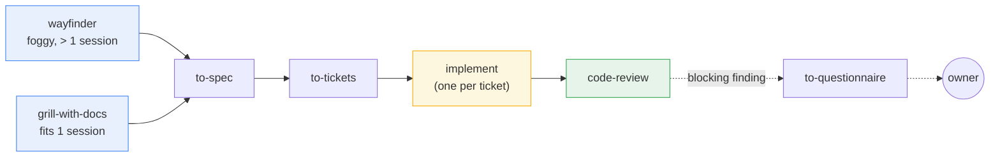
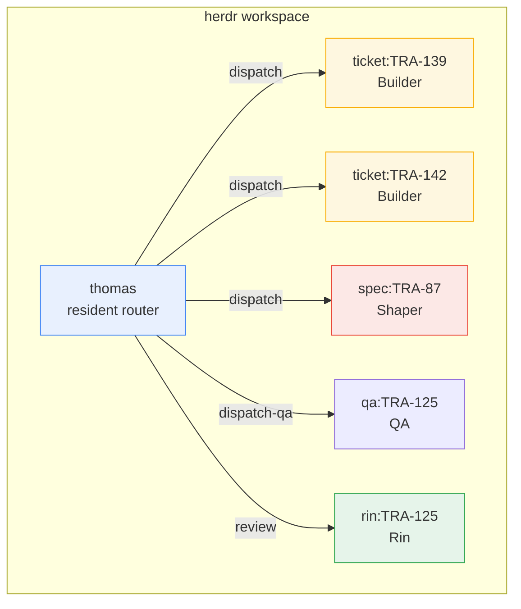
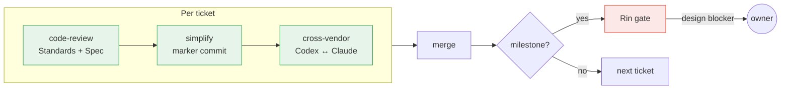

<p align="center">
  <strong>Astragentic</strong><br>
  <em>Multi-agent orchestration for real codebases</em>
</p>

<p align="center">
  
  
  
  
</p>

<p align="center">
  <strong>English</strong> ·
  <a href="README.vn.md">Tieng Viet</a>
</p>

---

AI coding agents are powerful alone. The moment you run several of them on a real codebase
— concurrent branches, shared state, legacy code — things break in predictable ways: agents
overwrite each other's work, reviews loop 5-14 rounds, and nobody knows what actually ran.

**Astragentic is an orchestration framework that coordinates multiple AI agents building
software together.** It handles isolation, dispatch, review, and provenance — so you get
concurrent agents that cannot collide, reviews that finish in one round, and artifacts that
prove what happened.

---

## Quickstart

```bash
# 1. Verify your machine has what's needed
./check-requirements.sh

# 2. Stage the harness into your project
./install.sh /path/to/your-repo

# 3. Open your repo in Claude Code and run the adaptive installer
cd /path/to/your-repo
claude "Read .astraler/releases/2.3.21/ADAPT-HARNESS.md completely and execute it."

# 4. Start the router
claude --agent thomas
```

Thomas reads your orchestrator config, claims the workspace, and begins routing work.

> **Prerequisites:** [Claude Code CLI](https://docs.anthropic.com/en/docs/claude-code),
> Git (with worktree support),
> [herdr](https://github.com/AstralEr/herdr) >= 0.8.0,
> [mattpocock-skills](https://github.com/mattpocock/skills) plugin >= 1.2.3

---

## Why this exists

### Agents collide without isolation

Two agents sharing a checkout: one runs `git switch` while the other is committing. Three
commits land on the wrong branch. **Astragentic gives each Builder its own git worktree** —
they share a frontier but never a checkout. Concurrent by design, isolated by construction.

### Reviews loop forever without structure

A prior system measured 5-14 review rounds per ticket. Round 2 added a lock, round 3 cut it,
round 8 was still cleaning up round 2's leftovers. **Astragentic runs one review round, three
layers deep** — code-review, simplify pass, cross-vendor arm — then it's done.

### Brownfield code gets ignored

Most agent skills assume a clean starting point. They have no concept of legacy, untestable,
or "standards that only exist in people's heads." **Astragentic ships four brownfield-specific
skills** that extract knowledge from the codebase as-is — never inventing what isn't there.

### Nobody knows what actually ran

An agent reports "done" — but did it run the simplify pass or skip it? Did it use the right
tool or a fallback that leaves the same marker? **Astragentic embeds provenance in every
artifact** — every commit carries a `Pass:` line naming what ran, every gate report has a
token-unique path.

---

## How it works

### Five roles, clear boundaries

| Role | Session | What it does |
|---|---|---|
| **Thomas** | resident | Routes work, manages the frontier, dispatches tickets, runs cross-vendor arm |
| **Shaper** | one unbroken session | Grills requirements, writes specs, cuts tickets — while the whole picture is in context |
| **Builder** | one per ticket | Implements in its own worktree — sole writer there |
| **Rin** | per milestone | Adversarial reviewer — verifies both the artifact and the process traces |
| **QA** | per walk | Exercises the running product — UI journeys, API contracts, real data |

### The workflow



Work enters through two doors based on scope. Both converge into the same pipeline:
**spec → tickets → implement → review**. The engineering method comes from
[Matt Pocock's skills](https://github.com/mattpocock/skills) — Astragentic wraps it with
orchestration and extends it to brownfield.

### Orchestration topology



Each Builder gets its own terminal pane and git worktree.
[herdr](https://github.com/AstralEr/herdr) manages the workspace topology.

### Review pipeline — one round, three layers



Every ticket passes all three layers — no exceptions. At milestones, Rin runs an additional
gate verifying both the artifact and the process traces. Design-level blockers go to the
owner, not to another review round.

---

## Brownfield skills

These close the gaps that upstream agent skills leave open:

| Skill | Purpose |
|---|---|
| `bootstrap-glossary` | Seeds a `CONTEXT.md` from your code — every term cites its source file |
| `batch-triage` | Converts an inherited backlog into tickets with labels and blocking edges |
| `legacy-testing` | Generates characterisation tests + seam creation for untested code |
| `untangle` | Refactoring path for code too tangled for standard architecture tools |

The rule: **extract, never invent**. A standard the code does not follow, or a glossary
term nobody confirmed, becomes confident-sounding lore that later agents treat as truth.

---

## Tech stack

### Required

| Component | Role |
|---|---|
| [**Claude Code CLI**](https://docs.anthropic.com/en/docs/claude-code) | Root runtime — every role can run here |
| **Git** (worktree support) | Isolation boundary — one worktree per Builder |
| [**herdr**](https://github.com/AstralEr/herdr) >= 0.8.0 | Terminal workspace manager — agent panes, prompt/wait/read |
| [**mattpocock-skills**](https://github.com/mattpocock/skills) >= 1.2.3 | Engineering method — wayfinder, grill, spec, tickets, implement, review |

### Optional

| Component | What it adds |
|---|---|
| **Codex CLI** | Cross-vendor arm — a second AI reviews every ticket |
| **OpenCode CLI** | Third runtime option for role dispatch |

---

## Installation

### Phase 1 — Stage

```bash
./check-requirements.sh              # verify machine readiness
./install.sh <target-repo>           # stage the release
```

This copies the harness into `<target>/.astraler/releases/<version>/`. No project files
are touched. Idempotent and immutable — rerunning does nothing, a staged release is a
fixed record.

### Phase 2 — Adapt

Open Claude Code (or Codex) in the target repo:

```
Read .astraler/releases/<version>/ADAPT-HARNESS.md completely and execute it.
```

The agent inspects your project, integrates the harness, runs brownfield bootstrap if needed,
and verifies everything by artifact.

### Phase 3 — Configure

Edit `.agents/orchestrator.md` — your file, never overwritten by upgrades:

```markdown
## Workspace identity
| Field | Value |
|---|---|
| workspace-label | `my-project` |

## Active assignments
| Role    | Runtime | Model           | Effort |
|---------|---------|-----------------|--------|
| thomas  | claude  | claude-opus-5   | medium |
| shaper  | claude  | claude-opus-5   | high   |
| builder | claude  | claude-sonnet-5 | medium |
| rin     | claude  | claude-opus-5   | medium |
| qa      | claude  | claude-sonnet-5 | low    |
```

Then: `claude --agent thomas`

---

## At a glance

| | |
|---|---|
| **Roles** | 5 — Thomas, Shaper, Builder, Rin, QA |
| **Skills** | 13+ orchestration, 4 brownfield-specific |
| **Runtimes** | Claude Code, Codex, OpenCode |
| **Review layers** | 3 per ticket (prior system: 5-14 rounds) |
| **Failure modes** | 123 measured, append-only evidence base |
| **Isolation** | 1 worktree per Builder, 1 branch per ticket |

---

## Project layout

```
harness/
  .agents/
    roles/            five role contracts + runtime supplements
    orchestrator.md   role -> runtime/model/effort (your file)
    skills/           13+ skills — dispatch, review, brownfield, arm
    memory/
      recurring-failure-modes.md
  .claude/
    agents/           Claude adapters (--agent <role>)
    skills/           Claude-discovered skills
  .opencode/agents/   OpenCode adapters
  .codex/profiles/    Codex role profiles
  scripts/
    herdr-watch-terminal.sh    turn watcher (Codex/OpenCode)
    herdr-watchdog.sh          safety-net, wakes Thomas on stuck panes
    ticket-git-facts.sh        git state for tracker reconciliation
    docs-staleness-audit.sh    word budgets, self-reported numbers
    check-reachability.sh      8 checks: exists, reachable, addressed
    check-requirements.sh      the doctor
docs/adr/                      architectural decision records
prompts/ADAPT-HARNESS.md       the semantic installer
install.sh                     staging script
check-requirements.sh          machine readiness check
```

## Glossary

| Term | Meaning |
|---|---|
| **package** | This repo — produces the harness |
| **adapted project** | A repo the harness was installed into |
| **payload** | What a release stages (may overwrite freely) |
| **scaffold** | Owner's config, written once, never overwritten (`orchestrator.md`) |
| **frontier** | The set of tickets currently claimable by agents |
| **gate** | A verification checkpoint — Rin's review at milestones |
| **arm** | Cross-vendor review pass (Codex reviews Claude's work, or vice versa) |
