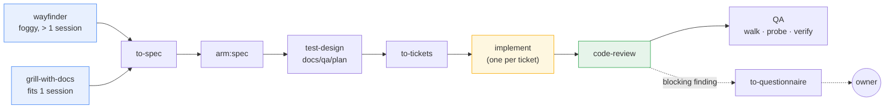
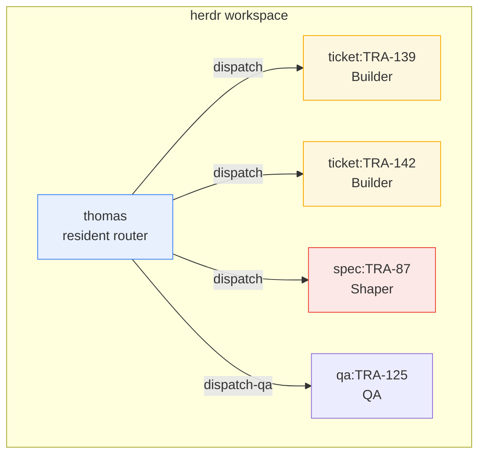
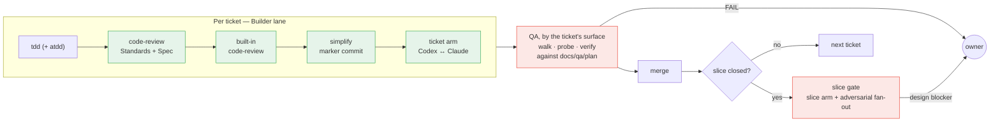

<p align="center">
  <strong>Astragentic</strong><br>
  <em>Multi-agent orchestration for real codebases</em>
</p>

<p align="center">
  <a href="RELEASE-NOTES.md"></a>
  
  <a href="harness/.agents/memory/recurring-failure-modes.md"></a>
  <a href="https://astragentic.thisistool.com/"></a>
  <a href="LICENSE"></a>
</p>

<p align="center">
  <a href="https://astragentic.thisistool.com/"><strong>Website</strong></a> ·
  <a href="RELEASE-NOTES.md">Release notes</a> ·
  <a href="https://astragentic.thisistool.com/tips/">Running several agents</a> ·
  <a href="docs/bmad-distilled/">BMAD role kit</a>
</p>

<p align="center">
  <strong>English</strong> ·
  <a href="README.vn.md">Tieng Viet</a>
</p>

---

AI coding agents are powerful alone. The moment you run several of them on a real codebase
— concurrent branches, shared state, legacy code — things break in predictable ways: agents
overwrite each other's work, reviews loop 5-14 rounds, and nobody knows what actually ran.

**Astragentic is an orchestration framework that coordinates multiple AI agents building
software together.** It handles isolation, dispatch, review, and provenance — so you get
concurrent agents that cannot collide, reviews that finish in one round, and artifacts that
prove what happened.

---

## Quickstart

```bash
# 1. In your project's root, stage the latest release (no project file is written)
cd /path/to/your-repo
curl -fsSL https://raw.githubusercontent.com/thientranhung/astragentic/main/get.sh | bash
#    …or pin a version:  | bash -s -- 3.1.1

# 2. Verify your machine has what's needed
bash .astraler/releases/3.1.1/check-requirements.sh

# 3. Run the adaptive installer in Claude Code
claude "Read .astraler/releases/3.1.1/ADAPT-HARNESS.md completely and execute it."

# 4. Start the router
claude --dangerously-skip-permissions --agent thomas --model claude-opus-5 --effort medium
```

Thomas reads your orchestrator config, claims the workspace, and begins routing work.

> **Prerequisites:** [Claude Code CLI](https://docs.anthropic.com/en/docs/claude-code),
> Git (with worktree support),
> [herdr](https://github.com/herdrdev/herdr) >= 0.8.0,
> [mattpocock-skills](https://github.com/mattpocock/skills) plugin >= 1.3.1

---

## Why this exists

### Agents collide without isolation

Two agents sharing a checkout: one runs `git switch` while the other is committing. Three
commits land on the wrong branch. **Astragentic gives each Builder its own git worktree** —
they share a frontier but never a checkout. Concurrent by design, isolated by construction.

### Reviews loop forever without structure

A prior system measured 5-14 review rounds per ticket. Round 2 added a lock, round 3 cut it,
round 8 was still cleaning up round 2's leftovers. **Astragentic runs one review round, three
layers deep** — code-review, simplify pass, cross-vendor arm — then it's done.

### Brownfield code gets ignored

Most agent skills assume a clean starting point. They have no concept of legacy, untestable,
or "standards that only exist in people's heads." **Astragentic ships four brownfield-specific
skills** that extract knowledge from the codebase as-is — never inventing what isn't there.

### Nobody knows what actually ran

An agent reports "done" — but did it run the simplify pass or skip it? Did it use the right
tool or a fallback that leaves the same marker? **Astragentic embeds provenance in every
artifact** — every commit carries a `Pass:` line naming what ran, every gate report has a
token-unique path.

---

## How it works

### Four roles, clear boundaries

| Role | Session | What it does |
|---|---|---|
| **Thomas** | resident | Routes work, manages the frontier, dispatches tickets, fires the slice gate |
| **Shaper** | one unbroken session | Grills requirements, writes specs, cuts tickets — while the whole picture is in context |
| **Builder** | one per ticket | Implements in its own worktree — sole writer there |
| **QA** | per walk | Exercises the running product — UI journeys, API contracts, real data |

### The workflow


```mermaid
flowchart LR
    A["wayfinder\nfoggy, > 1 session"] --> C[to-spec]
    B["grill-with-docs\nfits 1 session"] --> C
    C --> C2["arm:spec"] --> C3["test-design\ndocs/qa/plan"] --> D[to-tickets]
    D --> E["implement\n(one per ticket)"]
    E --> F["code-review"]
    F --> G["QA\nwalk · probe · verify"]
    F -.->|blocking finding| Q[to-questionnaire] -.-> Owner((owner))

    style A fill:#e8f0fe,stroke:#4285f4
    style B fill:#e8f0fe,stroke:#4285f4
    style E fill:#fef7e0,stroke:#f9ab00
    style F fill:#e6f4ea,stroke:#34a853
```

Work enters through two doors based on scope. Both converge into the same pipeline:
**spec → arm → test-design → tickets → implement → review → QA**. The engineering method comes from
[Matt Pocock's skills](https://github.com/mattpocock/skills) — Astragentic wraps it with
orchestration and extends it to brownfield.

### Orchestration topology


```mermaid
flowchart TB
    subgraph WS["herdr workspace"]
        T["thomas\nresident router"]
        T1["ticket:TRA-139\nBuilder"]
        T2["ticket:TRA-142\nBuilder"]
        T3["spec:TRA-87\nShaper"]
        T4["qa:TRA-125\nQA"]
    end

    T -->|dispatch| T1
    T -->|dispatch| T2
    T -->|dispatch| T3
    T -->|dispatch-qa| T4

    style T fill:#e8f0fe,stroke:#4285f4
    style T1 fill:#fef7e0,stroke:#f9ab00
    style T2 fill:#fef7e0,stroke:#f9ab00
    style T3 fill:#fce8e6,stroke:#ea4335
```

Each Builder gets its own terminal pane and git worktree.
[herdr](https://github.com/herdrdev/herdr) manages the workspace topology.

### Review pipeline — one round, three layers


```mermaid
flowchart LR
    subgraph PT["Per ticket — Builder lane"]
        direction LR
        R0["tdd (+ atdd)"] --> R1["code-review\nStandards + Spec"] --> R2["built-in\ncode-review"] --> R3["simplify\nmarker commit"] --> R4["ticket arm\nCodex ↔ Claude"]
    end
    PT --> QA["QA, by the ticket's surface\nwalk · probe · verify\nagainst docs/qa/plan"]
    QA --> M["merge"]
    M --> SC{"slice closed?"}
    SC -->|yes| SG["slice gate\nslice arm + adversarial fan-out"]
    SC -->|no| Next["next ticket"]
    QA -->|FAIL| Owner(("owner"))
    SG -->|design blocker| Owner

    style R1 fill:#e6f4ea,stroke:#34a853
    style R2 fill:#e6f4ea,stroke:#34a853
    style R3 fill:#e6f4ea,stroke:#34a853
    style R4 fill:#e6f4ea,stroke:#34a853
    style QA fill:#fce8e6,stroke:#ea4335
    style SG fill:#fce8e6,stroke:#ea4335
```

Every ticket passes the Builder lane reviews — no exceptions. Before a PR, a merge or a
release, QA walks the running product. When a slice closes, Thomas fires the slice arm and one
read-only adversarial fan-out, then folds what both find. Design-level blockers go to the
owner, not to another review round.

---

## Brownfield skills

These close the gaps that upstream agent skills leave open:

| Skill | Purpose |
|---|---|
| `bootstrap-glossary` | Seeds a `GLOSSARY.md` from your code — every term cites its source file |
| `batch-triage` | Converts an inherited backlog into tickets with labels and blocking edges |
| `legacy-testing` | Generates characterisation tests + seam creation for untested code |
| `untangle` | Refactoring path for code too tangled for standard architecture tools |

The rule: **extract, never invent**. A standard the code does not follow, or a glossary
term nobody confirmed, becomes confident-sounding lore that later agents treat as truth.

---

## A role kit, alongside the method

`mattpocock-skills` is the **method**: it is wired into the role contracts, and every ticket
travels through it. [`docs/bmad-distilled/`](docs/bmad-distilled/) is something else — a
**role kit** for the sessions that stand outside that road, when there is no ticket to
dispatch yet and you want a specialist rather than a generic assistant.

It is [BMAD](https://bmadcode.com) distilled to markdown: one `roster.md` naming eight roles,
and `capabilities/` holding 44 files, one per workflow. The personas are quoted verbatim from
the original; the python resolver, `config.yaml` and the rest of the install machinery are
gone. There is nothing to install, and an agent loads one role plus one or two capabilities
rather than the whole set.

```
Play Winston in docs/bmad-distilled/roster.md, following
docs/bmad-distilled/capabilities/architecture.md. Design the architecture for: …
```

Since 2.19.0 six of the roles also ship **inside the payload**, as agents of the dispatch
plugin (`astragentic-dispatch:bmad-mary|john|sally|winston|murat|paige`), rewritten in the
method's own vocabulary and bound to advise only. Two skills reach them: `/bmad-party <topic>`
runs a round table of personas as a team of peer agents in the owner's session, and
`/bmad-ux audit|polish|upgrade <surface>` runs Sally's pass on one surface, in the session or
fanned out read-only from a Builder or QA. Both produce findings and positions, never
artifacts; a conclusion enters the pipeline through the Shaper like any other input.

**The limit, stated plainly.** A role kit is prompt level, not contract level. No hook and no
gate makes an agent follow the file it just read. It improves the shape of an answer; it does
not prove a step ran. Where proof is what you need, it is still a contract, a receipt and a
gate.

---

## Greenfield — the first session

An empty repo **skips `bootstrap-glossary` and `batch-triage`** — both read something that
does not exist yet. The glossary arrives from `grill-with-docs` in step 2 instead.

Type these into the `thomas` tab, in order. Each step waits on the previous one's artifact.

**1. Confirm the ground**
> Read `docs/agents/issue-tracker.md`. Tell me which tracker, the ticket prefix, and whether
> the project id is set. There is no code in this repo — infer nothing from it.

**2. Bring the idea in**
> The idea: `<3-5 sentences>`. If it is bigger than one session and still foggy, run
> `/mattpocock-skills:wayfinder`. If the destination is clear, dispatch a Shaper whose brief
> opens with `/mattpocock-skills:grill-with-docs`.

**3. Answer the grill.** The expensive step, and the one that cannot be skipped. An empty repo
makes **you the only source** — every question the Shaper does not ask becomes something it
invents.

**4. Make Thomas fire `arm: spec`**
> Is the spec done? Fire `arm: spec` before the Shaper cuts tickets, then report the findings.

On greenfield there is no existing code to contradict a wrong seam. The spec is the only
artifact, so this is a real gate rather than a formality.

**5. Ticket #1 is a tracer bullet, not a feature**
> Ticket #1 must run end to end through every layer, however thin. If `to-tickets` produces a
> ticket that builds one layer only, tell me.

**6. Only start `/loop` once 3-4 independent tickets exist.** For the first few slices the
frontier is a straight chain and `builder-target` cannot be reached — that is the frontier
telling the truth, not Thomas idling.

---

## Tech stack

### Required

| Component | Role |
|---|---|
| [**Claude Code CLI**](https://docs.anthropic.com/en/docs/claude-code) | Root runtime — every role can run here |
| **Git** (worktree support) | Isolation boundary — one worktree per Builder |
| [**herdr**](https://github.com/herdrdev/herdr) >= 0.8.0 | Terminal workspace manager — agent panes, prompt/wait/read |
| [**mattpocock-skills**](https://github.com/mattpocock/skills) >= 1.3.1 | Engineering method — wayfinder, grill, spec, tickets, implement, review |

### Optional

| Component | What it adds |
|---|---|
| **Codex CLI** | Cross-vendor arm — a second AI reviews every ticket |
| **OpenCode CLI** | Third runtime option for role dispatch |

---

## Installation

### Phase 1 — Stage

Run in the project's root. `get.sh` fetches one tagged release into
`~/.cache/astragentic/<version>/` and runs **that release's own** `install.sh` against the
current directory, so the staging, the three-way arbitration and the hook merge are the ones
the release shipped with.

```bash
cd /path/to/your-repo
curl -fsSL https://raw.githubusercontent.com/thientranhung/astragentic/main/get.sh | bash                      # latest, stage only
curl -fsSL https://raw.githubusercontent.com/thientranhung/astragentic/main/get.sh | bash -s -- 3.1.1         # pin a version
curl -fsSL https://raw.githubusercontent.com/thientranhung/astragentic/main/get.sh | bash -s -- latest --plan  # show what --apply would write
curl -fsSL https://raw.githubusercontent.com/thientranhung/astragentic/main/get.sh | bash -s -- latest --apply # write the payload in
```

Staging copies the harness into `<project>/.astraler/releases/<version>/` and touches no
project file; it is idempotent and immutable. `--apply` writes the payload in: new files land,
unchanged files are skipped, your scaffold (`orchestrator.md`, `settings.json`'s own keys,
`.codex/profiles/`) is kept, hook events and scripts the project has never had are merged
into `settings.json` and named under `MERGED`, and anything both sides changed is listed under
`CONFLICTS` for Phase 2 to decide. `ASTRAGENTIC_REPO` and `ASTRAGENTIC_CACHE` override the
source and the cache.

From a checkout of this package the same two steps are `./install.sh <target-repo>` and
`./install.sh <target-repo> --apply`; `get.sh` is that, fetched for you.

### Phase 2 — Adapt

Open Claude Code (or Codex) in the target repo:

```
Read .astraler/releases/<version>/ADAPT-HARNESS.md completely and execute it.
```

The agent inspects your project, integrates the harness, runs brownfield bootstrap if needed,
and verifies everything by artifact.

### Phase 3 — Configure

Edit `.agents/orchestrator.md` — your file, never overwritten by upgrades:

```markdown
## Workspace identity
| Field | Value |
|---|---|
| workspace-label | `my-project` |

## Active assignments
| Role    | Runtime | Model           | Effort |
|---------|---------|-----------------|--------|
| thomas  | claude  | claude-opus-5   | medium |
| shaper  | claude  | claude-opus-5   | high   |
| builder | claude  | claude-sonnet-5 | medium |
| qa      | claude  | claude-sonnet-5 | low    |
```

Then: `claude --dangerously-skip-permissions --agent thomas --model claude-opus-5 --effort medium`

---

## Versions and releases

`VERSION` is the single source, and it is the number a staged release is named after:
`.astraler/releases/<version>/`. [`RELEASE-NOTES.md`](RELEASE-NOTES.md) carries one entry per
release, newest first, and every version it documents has a git tag on the commit that set it.

```bash
cat VERSION                          # what this checkout is
git tag --sort=-v:refname | head     # the ladder, newest first
git log --oneline -- VERSION         # every bump, with the sentence that named it
```

Releases are read as prose rather than as a changelog: each entry says what broke, what the
evidence was, and what the fix refuses to do. An entry that only listed changed files would
not be able to say why the change is there — and the ledger it draws from is the reason the
package has a memory at all.

The rule when upgrading: read the entry for **every** version between yours and the new one.
A patch release in this package is often the correction of a defect the previous one shipped,
so the interesting sentence is rarely in the newest entry alone.

### Upgrading

The same one-liner, between tickets, in the project's root:

```bash
cat .astraler/state/applied-version                                                                             # what you are on
curl -fsSL https://raw.githubusercontent.com/thientranhung/astragentic/main/get.sh | bash -s -- latest --apply   # stage + write the new payload
claude "Read .astraler/releases/<new-version>/ADAPT-HARNESS.md completely and execute it."                        # verify, reconcile conflicts, record the receipt
```

Three things the upgrade does not do for you, each stated because it was measured: it does
not change a running pane — the dispatch mod loads at session start, so a Builder keeps the
mod it was launched with and the dispatcher's session reloads only with hot reload on; it does
not touch the project's layer — `.astraler/project/` (plugs, overlays) and `orchestrator.md`
are yours, and a release that adds a column there says so and leaves the edit to you; and it
does not announce itself — nothing in the project knows a newer tag exists until you run the
command, so check `git ls-remote --tags https://github.com/thientranhung/astragentic.git` or
the releases page when you want to know.

---

## At a glance

| | |
|---|---|
| **Roles** | 4 — Thomas, Shaper, Builder, QA |
| **Skills** | 16 in the harness, 4 of them brownfield-specific |
| **Runtimes** | Claude Code, Codex, OpenCode |
| **Review layers** | 3 per ticket (prior system: 5-14 rounds) |
| **Failure modes** | 138 measured, append-only evidence base |
| **Isolation** | 1 worktree per Builder, 1 branch per ticket |

---

## Project layout

```
harness/
  .agents/
    roles/            four role contracts + runtime supplements
    orchestrator.md   role -> runtime/model/effort (your file)
    skills/           19 skills — dispatch, QA, test design, brownfield, arm, BMAD
    memory/
      recurring-failure-modes.md
  .claude/
    agents/           Claude adapters (--agent <role>)
    skills/           Claude-discovered skills
  .opencode/agents/   OpenCode adapters
  .codex/profiles/    machine-local Codex pane-launch profile templates
  .codex/agents/      project-local, read-only-intent Codex helper agents
  .codex/hooks.json   project-local Codex safety hook registration
  scripts/                     see "When each script runs" below
docs/adr/                      architectural decision records
docs/bmad-distilled/           the BMAD role kit — roster + 44 capability files
prompts/ADAPT-HARNESS.md       the semantic installer
get.sh                         the one-liner: fetch a tagged release, run its install.sh here
install.sh                     staging script
check-requirements.sh          machine readiness check
VERSION                        the number a staged release is named after
RELEASE-NOTES.md               one entry per release, newest first
```

## Removing it

**`prompts/UNINSTALL-HARNESS.md`, the mirror of `ADAPT-HARNESS.md`.** It stages into every
release beside it, so removal is classified against the bytes the project actually received:

```
Read .astraler/releases/<applied>/UNINSTALL-HARNESS.md completely and execute it.
```

There is no `uninstall.sh`, and the reason is the reason `install.sh` is not the semantic
installer either. The mechanical half of removal is `rm`. The hard half is deciding, for every
file at a path the payload also ships, whether the PROJECT wrote it — and that is judgement over
evidence, which is what a prompt is for and what a script cannot do. The evidence exists: the
applied release directory is a byte-exact record of what shipped, so `diff -rq` separates the
package's files from the project's, and `check-payload-drift.sh`'s manifest says the same thing
independently.

The prompt fails closed — a file it cannot classify is a file it keeps and reports — and it names
what to KEEP: the three `docs/agents/` files come from `setup-matt-pocock-skills` and describe
your tracker rather than this harness, and the ledger is your project's own measured history.

## When each script runs

Every script has a moment and an owner. A script with neither is one nobody runs until
something has already gone wrong.

**In the pipeline — a role's contract names these, and they run without anyone remembering:**

| Script | Moment | Owner |
|---|---|---|
| `herdr-watchdog.sh` | before any dispatch, and it stays running | Thomas — `dispatch-ticket` refuses to dispatch without it |
| `herdr-watch-terminal.sh` | per turn on a Codex/OpenCode pane | called by the watchdog, not by hand |
| `check-simplify-markers.sh` | Builder before handback, Thomas before merge | both, independently |
| `ticket-git-facts.sh` | session start and after every merge | `reconcile-tracker` |
| `check-payload-drift.sh` | pre-commit | the git hook, where a project has installed one |
| `.githooks/pre-commit` | every commit, once `core.hooksPath` points at it | git — it refuses a staged blob over 50 MB |
| `project-status-sync.sh` | at claim, at the merge write-back, at session start | Thomas, GitHub projects only |
| `check-requirements.sh` | install, upgrade, and when a runtime misbehaves | whoever is installing |

**On the harness itself — these run when the PAYLOAD changes, not when work happens:**

| Script | Moment |
|---|---|
| `check-reachability.py` | after editing any contract, skill or the README role table |
| `docs-staleness-audit.sh` | same moment — it measures the surfaces that bill every session |
| `ledger-index.sh` | after adding or editing a ledger entry |

**Run all three together; they are one gesture, and the release that skipped them is the
argument for it.** 2.5.0 shipped adapters that named another project's real ticket ids, a stale
index, and two contracts over their word budget — three classes, none visible by reading, all
introduced by careful work an hour earlier. 2.5.1 is those fixes and nothing else.

```bash
python3 scripts/check-reachability.py .   # exit 0 required
bash scripts/ledger-index.sh              # regenerates INDEX.md
bash scripts/docs-staleness-audit.sh .    # exit 1 = read every finding
```

A project that never edits the harness never needs the second table. That is the normal case,
and it is why these three are named here rather than in a role's contract: **a rule in a
contract is read every time the role starts, and a rule nobody needs most days does not belong
there.**

## Glossary

| Term | Meaning |
|---|---|
| **package** | This repo — produces the harness |
| **adapted project** | A repo the harness was installed into |
| **payload** | What a release stages (may overwrite freely) |
| **scaffold** | Owner's config, written once, never overwritten (`orchestrator.md`) |
| **frontier** | The set of tickets currently claimable by agents |
| **gate** | A verification checkpoint — QA's walk of the running product, or the slice gate at slice close |
| **arm** | Cross-vendor review pass (Codex reviews Claude's work, or vice versa) |
