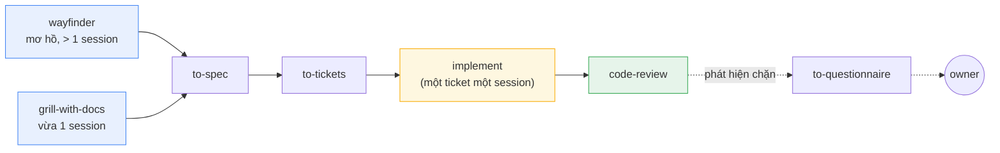
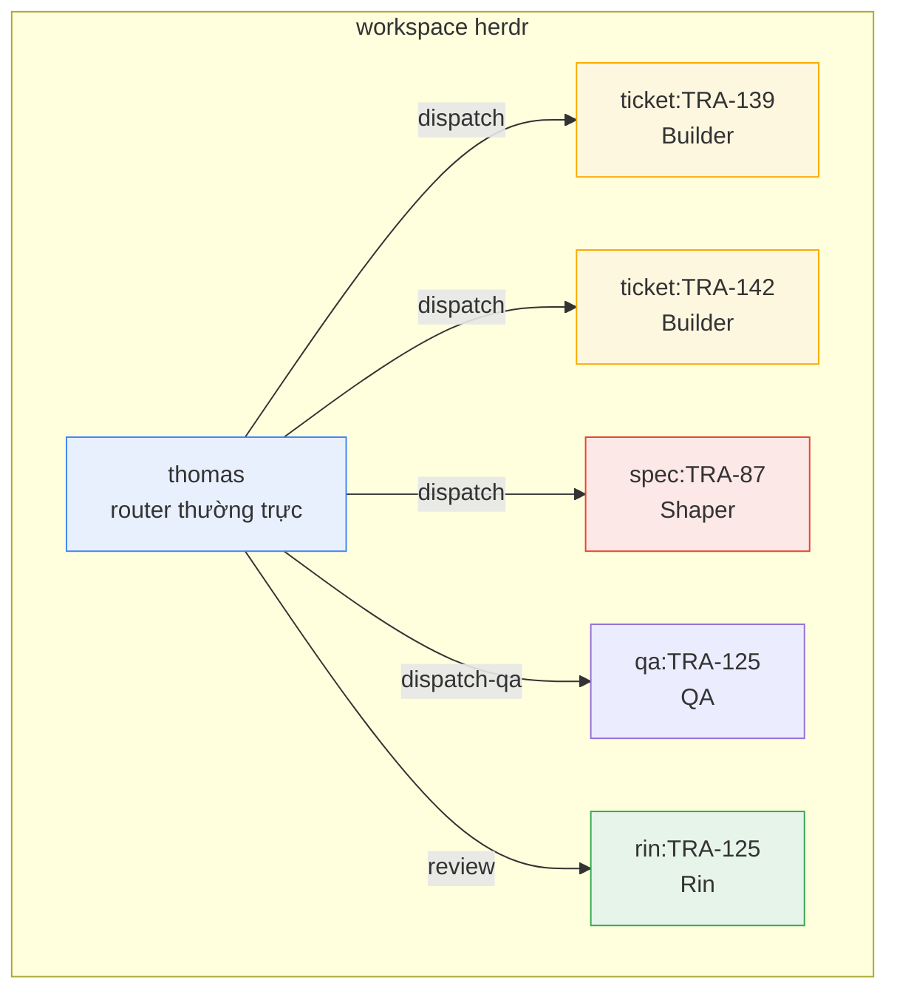
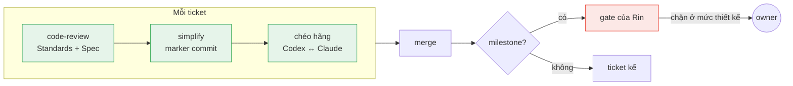

<p align="center">
  <strong>Astragentic</strong><br>
  <em>Điều phối nhiều AI agent trên codebase thật</em>
</p>

<p align="center">
  <a href="RELEASE-NOTES.md"></a>
  
  <a href="harness/.agents/memory/recurring-failure-modes.md"></a>
  <a href="https://astragentic.thisistool.com/vi/"></a>
</p>

<p align="center">
  <a href="https://astragentic.thisistool.com/vi/"><strong>Website</strong></a> ·
  <a href="RELEASE-NOTES.md">Release notes</a> ·
  <a href="https://astragentic.thisistool.com/vi/kinh-nghiem/">Kinh nghiệm chạy nhiều agent</a> ·
  <a href="docs/bmad-distilled/">BMAD role kit</a>
</p>

<p align="center">
  <a href="README.md">English</a> ·
  <strong>Tieng Viet</strong>
</p>

---

Một AI coding agent chạy riêng lẻ đã rất mạnh. Nhưng khi bạn cho vài agent cùng làm trên một
codebase thật — nhiều branch song song, state dùng chung, code cũ — mọi thứ hỏng theo những
cách đoán trước được: agent ghi đè việc của nhau, review lặp 5–14 vòng, và không ai biết
thực tế đã có bước nào chạy.

**Astragentic là một framework điều phối nhiều AI agent cùng xây phần mềm.** Nó lo phần cô
lập, dispatch, review và dấu vết — để bạn có nhiều agent chạy song song mà không thể va vào
nhau, review xong trong một vòng, và artifact chứng minh được điều gì đã thật sự xảy ra.

---

## Bắt đầu nhanh

```bash
# 1. Kiểm máy đã đủ thứ cần chưa
./check-requirements.sh

# 2. Stage harness vào project của bạn
./install.sh /path/to/your-repo

# 3. Mở repo bằng Claude Code và chạy bộ cài thích nghi
cd /path/to/your-repo
claude "Read .astraler/releases/2.8.1/ADAPT-HARNESS.md completely and execute it."

# 4. Mở router
claude --dangerously-skip-permissions --agent thomas --model claude-opus-5 --effort medium
```

Thomas đọc file cấu hình orchestrator, claim workspace, rồi bắt đầu điều phối công việc.

> **Cần có trước:** [Claude Code CLI](https://docs.anthropic.com/en/docs/claude-code),
> Git (có worktree),
> [herdr](https://github.com/herdrdev/herdr) >= 0.8.0,
> plugin [mattpocock-skills](https://github.com/mattpocock/skills) >= 1.2.3

---

## Vì sao nó tồn tại

### Không cô lập thì agent va nhau

Hai agent dùng chung một checkout: một bên chạy `git switch` trong lúc bên kia đang commit.
Ba commit rơi vào nhầm branch. **Astragentic cấp cho mỗi Builder một git worktree riêng** —
chúng dùng chung frontier nhưng không bao giờ chung checkout. Song song theo thiết kế, cô lập
theo cấu trúc.

### Không có cấu trúc thì review lặp vô hạn

Một hệ thống trước đó đo được 5–14 vòng review cho mỗi ticket. Vòng 2 thêm một lock, vòng 3
bỏ nó đi, vòng 8 vẫn còn đang dọn phần thừa của vòng 2. **Astragentic chạy một vòng review,
sâu ba lớp** — code-review, lượt simplify, arm chéo hãng — rồi dừng.

### Code brownfield bị bỏ qua

Phần lớn agent skill mặc định bạn bắt đầu từ một repo sạch. Chúng không có khái niệm về code
cũ, về thứ không test được, hay về "tiêu chuẩn chỉ tồn tại trong đầu vài người".
**Astragentic ship bốn skill riêng cho brownfield**, rút kiến thức ra từ chính codebase như
nó đang có — không bịa ra thứ không tồn tại.

### Không ai biết thực tế đã chạy gì

Agent báo "xong" — nhưng nó có chạy lượt simplify hay bỏ qua? Nó dùng đúng công cụ, hay dùng
một fallback để lại cùng một marker? **Astragentic nhúng dấu vết vào mọi artifact** — mỗi
commit mang một dòng `Pass:` khai những gì đã chạy, mỗi báo cáo gate nằm ở một đường dẫn duy
nhất theo token.

---

## Nó hoạt động thế nào

### Năm role, ranh giới rõ

| Role | Session | Làm gì |
|---|---|---|
| **Thomas** | thường trực | Điều phối, giữ frontier, dispatch ticket, chạy arm chéo hãng |
| **Shaper** | một session liền mạch | Grill yêu cầu, viết spec, cắt ticket — khi cả bức tranh còn trong context |
| **Builder** | một session mỗi ticket | Thi công trong worktree riêng — là người ghi duy nhất ở đó |
| **Rin** | một lần mỗi milestone | Reviewer đối kháng — kiểm cả artifact lẫn dấu vết quy trình |
| **QA** | một lần mỗi walk | Dùng sản phẩm đang chạy — hành trình UI, hợp đồng API, dữ liệu thật |

### Quy trình



Công việc đi vào qua hai cửa tuỳ phạm vi. Cả hai nhập vào cùng một pipeline:
**spec → ticket → implement → review**. Phương pháp phát triển đến từ
[skill của Matt Pocock](https://github.com/mattpocock/skills) — Astragentic bọc điều phối
quanh nó và mở rộng sang brownfield.

### Cấu trúc điều phối



Mỗi Builder có một pane terminal riêng và một git worktree riêng.
[herdr](https://github.com/herdrdev/herdr) quản lý cấu trúc workspace.

### Pipeline review — một vòng, ba lớp



Mọi ticket đều đi qua cả ba lớp — không có ngoại lệ. Ở mỗi milestone, Rin chạy thêm một gate
kiểm cả artifact lẫn dấu vết quy trình. Thứ chặn ở mức thiết kế đi lên owner, không đi vào
thêm một vòng review nữa.

---

## Skill cho brownfield

Bốn skill này lấp đúng những chỗ mà agent skill phổ thông bỏ ngỏ:

| Skill | Việc |
|---|---|
| `bootstrap-glossary` | Dựng `CONTEXT.md` từ chính code — mỗi từ mang theo file nó được đọc ra |
| `batch-triage` | Biến một backlog thừa kế thành ticket có nhãn và blocking edge |
| `legacy-testing` | Sinh characterisation test và dựng seam cho code chưa có test |
| `untangle` | Đường refactor cho code rối hơn mức công cụ kiến trúc thông thường xử lý được |

Nguyên tắc: **trích, không bịa**. Một tiêu chuẩn mà code không hề tuân theo, hay một từ trong
glossary không ai xác nhận, sẽ thành lore nghe rất chắc chắn mà các agent sau coi là sự thật.

---

## Một role kit, đứng cạnh phương pháp

`mattpocock-skills` là **phương pháp**: nó được gắn vào contract của từng role, và mọi ticket
đều đi qua nó. [`docs/bmad-distilled/`](docs/bmad-distilled/) là thứ khác — một **role kit**
cho những session đứng ngoài đường chính, lúc chưa có ticket nào để dispatch và bạn muốn một
chuyên gia thay vì một trợ lý chung.

Đó là [BMAD](https://bmadcode.com) chưng xuống còn markdown: một file `roster.md` khai tám
role, và `capabilities/` chứa 44 file, mỗi workflow một file. Persona được trích nguyên văn từ
bản gốc; python resolver, `config.yaml` và toàn bộ máy móc cài đặt đã bị bỏ đi. Không còn gì
để cài, và agent nạp một role cộng một tới hai capability chứ không nạp cả bộ.

```
Đóng vai Winston trong docs/bmad-distilled/roster.md, theo
docs/bmad-distilled/capabilities/architecture.md. Thiết kế kiến trúc cho: …
```

**Giới hạn, nói thẳng.** Một role kit là mức prompt, không phải mức contract. Không hook nào,
không gate nào bắt agent đi đúng file nó vừa đọc. Nó cải thiện hình dạng của câu trả lời; nó
không chứng minh một bước đã chạy. Chỗ nào cần chứng minh thì vẫn phải là contract, receipt và
gate.

---

## Greenfield — session đầu tiên

Một repo rỗng **bỏ qua `bootstrap-glossary` và `batch-triage`** — cả hai đều đọc một thứ chưa
tồn tại. Glossary sẽ đến từ `grill-with-docs` ở bước 2.

Gõ những câu dưới đây vào tab `thomas`, theo thứ tự. Mỗi bước chờ artifact của bước trước.

**1. Chốt mặt bằng**
> Read `docs/agents/issue-tracker.md`. Tell me which tracker, the ticket prefix, and whether
> the project id is set. There is no code in this repo — infer nothing from it.

**2. Đưa ý tưởng vào**
> The idea: `<3-5 sentences>`. If it is bigger than one session and still foggy, run
> `/mattpocock-skills:wayfinder`. If the destination is clear, dispatch a Shaper whose brief
> opens with `/mattpocock-skills:grill-with-docs`.

**3. Trả lời phần grill.** Đây là bước tốn kém nhất, và là bước không bỏ được. Repo rỗng làm
**bạn thành nguồn duy nhất** — mọi câu Shaper không hỏi sẽ thành một thứ nó tự bịa ra.

**4. Bắt Thomas bắn `arm: spec`**
> Is the spec done? Fire `arm: spec` before the Shaper cuts tickets, then report the findings.

Trên greenfield không có code sẵn để phản bác một seam sai. Spec là artifact duy nhất, nên đây
là một gate thật chứ không phải thủ tục.

**5. Ticket #1 là viên đạn dẫn đường, không phải một tính năng**
> Ticket #1 must run end to end through every layer, however thin. If `to-tickets` produces a
> ticket that builds one layer only, tell me.

**6. Chỉ bật `/loop` khi đã có 3–4 ticket độc lập.** Với vài lát đầu tiên, frontier còn là một
chuỗi thẳng và `builder-target` không thể đạt được — đó là frontier đang nói đúng sự thật,
không phải Thomas ngồi không.

---

## Tech stack

### Bắt buộc

| Thành phần | Vai trò |
|---|---|
| [**Claude Code CLI**](https://docs.anthropic.com/en/docs/claude-code) | Runtime nền — mọi role đều chạy được ở đây |
| **Git** (có worktree) | Ranh giới cô lập — mỗi Builder một worktree |
| [**herdr**](https://github.com/herdrdev/herdr) >= 0.8.0 | Quản lý workspace terminal — pane cho agent, prompt/wait/read |
| [**mattpocock-skills**](https://github.com/mattpocock/skills) >= 1.2.3 | Phương pháp — wayfinder, grill, spec, tickets, implement, review |

### Tuỳ chọn

| Thành phần | Thêm được gì |
|---|---|
| **Codex CLI** | Arm chéo hãng — một AI thứ hai đọc lại mọi ticket |
| **OpenCode CLI** | Runtime thứ ba để dispatch role |

---

## Cài đặt

### Pha 1 — Stage

```bash
./check-requirements.sh              # kiểm máy đã sẵn sàng chưa
./install.sh <target-repo>           # stage release (không sửa file nào của project)
./install.sh <target-repo> --plan    # xem --apply sẽ ghi những gì
./install.sh <target-repo> --apply   # ghi thẳng payload vào
```

Lệnh này chép harness vào `<target>/.astraler/releases/<version>/`. Không file nào của project
bị đụng tới. Idempotent và bất biến — chạy lại không làm gì thêm, một release đã stage là một
bản ghi cố định.

### Pha 2 — Thích nghi

Mở Claude Code (hoặc Codex) trong repo đích:

```
Read .astraler/releases/<version>/ADAPT-HARNESS.md completely and execute it.
```

Agent khảo sát project của bạn, tích hợp harness, chạy bootstrap brownfield nếu cần, và kiểm
lại mọi thứ bằng artifact.

### Pha 3 — Cấu hình

Sửa `.agents/orchestrator.md` — file của bạn, không bao giờ bị bản nâng cấp ghi đè:

```markdown
## Workspace identity
| Field | Value |
|---|---|
| workspace-label | `my-project` |

## Active assignments
| Role    | Runtime | Model           | Effort |
|---------|---------|-----------------|--------|
| thomas  | claude  | claude-opus-5   | medium |
| shaper  | claude  | claude-opus-5   | high   |
| builder | claude  | claude-sonnet-5 | medium |
| rin     | claude  | claude-opus-5   | medium |
| qa      | claude  | claude-sonnet-5 | low    |
```

Rồi: `claude --dangerously-skip-permissions --agent thomas --model claude-opus-5 --effort medium`

---

## Version và release

`VERSION` là nguồn duy nhất, và nó là con số đặt tên cho một release đã stage:
`.astraler/releases/<version>/`. [`RELEASE-NOTES.md`](RELEASE-NOTES.md) có một mục cho mỗi
release, mới nhất ở trên, và mọi version được ghi trong đó đều có một git tag trên đúng commit
đã đặt nó.

```bash
cat VERSION                          # bản checkout này đang ở đâu
git tag --sort=-v:refname | head     # cả cái thang, mới nhất trước
git log --oneline -- VERSION         # mọi lần bump, kèm câu đã đặt tên cho nó
```

Release notes ở đây đọc như văn xuôi chứ không phải changelog: mỗi mục nói cái gì đã hỏng,
bằng chứng là gì, và bản vá **từ chối** làm gì. Một mục chỉ liệt kê file đã đổi thì không nói
được vì sao thay đổi đó có mặt — và cuốn sổ lỗi mà nó rút ra chính là lý do package này có trí
nhớ.

Luật khi nâng cấp: đọc mục của **mọi** version nằm giữa bản bạn đang dùng và bản mới. Một bản
patch ở đây thường là bản sửa cho một defect mà bản trước vừa ship, nên câu đáng đọc hiếm khi
nằm riêng trong mục mới nhất.

---

## Nhìn nhanh

| | |
|---|---|
| **Role** | 5 — Thomas, Shaper, Builder, Rin, QA |
| **Skill** | 16 trong harness, 4 trong số đó dành cho brownfield |
| **Runtime** | Claude Code, Codex, OpenCode |
| **Lớp review** | 3 mỗi ticket (hệ thống trước: 5–14 vòng) |
| **Failure mode** | 136 đã đo, cơ sở bằng chứng chỉ thêm |
| **Cô lập** | 1 worktree mỗi Builder, 1 branch mỗi ticket |

---

## Bố cục repo

```
harness/
  .agents/
    roles/            năm contract role + phần bổ sung theo runtime
    orchestrator.md   role -> runtime/model/effort (file của bạn)
    skills/           16 skill — dispatch, review, brownfield, arm
    memory/
      recurring-failure-modes.md
  .claude/
    agents/           adapter Claude (--agent <role>)
    skills/           skill Claude tự tìm thấy
  .opencode/agents/   adapter OpenCode
  .codex/profiles/    template profile launch pane cho Codex, cục bộ theo máy
  .codex/agents/      agent phụ trợ Codex, cục bộ theo project, chỉ đọc
  .codex/hooks.json   đăng ký safety hook của Codex, cục bộ theo project
  scripts/                     xem "Script nào chạy lúc nào" bên dưới
docs/adr/                      architectural decision record
docs/bmad-distilled/           BMAD role kit — roster + 44 file capability
prompts/ADAPT-HARNESS.md       bộ cài ngữ nghĩa
install.sh                     script stage
check-requirements.sh          kiểm máy
VERSION                        con số đặt tên cho một release đã stage
RELEASE-NOTES.md               một mục mỗi release, mới nhất trước
```

## Gỡ nó ra

**`prompts/UNINSTALL-HARNESS.md`, bản đối xứng của `ADAPT-HARNESS.md`.** Nó được stage vào mọi
release nằm cạnh file kia, nên việc gỡ được phân loại dựa trên đúng những byte mà project đã
thật sự nhận:

```
Read .astraler/releases/<applied>/UNINSTALL-HARNESS.md completely and execute it.
```

Không có `uninstall.sh`, và lý do cũng là lý do `install.sh` không phải bộ cài ngữ nghĩa. Nửa
cơ học của việc gỡ là `rm`. Nửa khó là quyết định, với từng file nằm ở một đường dẫn mà payload
cũng ship, rằng PROJECT có phải là bên đã viết nó không — đó là phán đoán trên bằng chứng, việc
của một prompt chứ không phải của một script. Bằng chứng có sẵn: thư mục release đã áp dụng là
bản ghi byte-exact của thứ đã ship, nên `diff -rq` tách được file của package khỏi file của
project, và manifest của `check-payload-drift.sh` nói y hệt một cách độc lập.

Prompt này fail closed — file nào nó không phân loại được là file nó giữ lại và báo cáo — và nó
khai rõ cái gì phải GIỮ: ba file trong `docs/agents/` đến từ `setup-matt-pocock-skills` và mô tả
tracker của bạn chứ không phải harness này, còn cuốn sổ lỗi là lịch sử đã đo của chính project
bạn.

## Script nào chạy lúc nào

Mỗi script có một thời điểm và một người sở hữu. Script không có cả hai là script không ai chạy
cho tới khi có chuyện đã xảy ra rồi.

**Trong pipeline — contract của một role gọi tên chúng, và chúng chạy mà không ai phải nhớ:**

| Script | Thời điểm | Người sở hữu |
|---|---|---|
| `herdr-watchdog.sh` | trước mọi lần dispatch, và nó chạy suốt | Thomas — `dispatch-ticket` từ chối dispatch khi thiếu nó |
| `herdr-watch-terminal.sh` | mỗi lượt, trên pane Codex/OpenCode | watchdog gọi, không gọi tay |
| `check-simplify-markers.sh` | Builder trước handback, Thomas trước merge | cả hai, độc lập nhau |
| `ticket-git-facts.sh` | đầu session và sau mỗi lần merge | `reconcile-tracker` |
| `check-payload-drift.sh` | pre-commit | git hook, ở project đã cài |
| `.githooks/pre-commit` | mỗi lần commit, sau khi `core.hooksPath` trỏ vào nó | git — từ chối blob đã stage trên 50 MB |
| `project-status-sync.sh` | lúc claim, lúc ghi ngược sau merge, đầu session | Thomas, chỉ với GitHub Projects |
| `check-requirements.sh` | lúc cài, lúc nâng cấp, và khi một runtime giở chứng | ai đang cài |

**Trên chính harness — chạy khi PAYLOAD đổi, không phải khi công việc diễn ra:**

| Script | Thời điểm |
|---|---|
| `check-reachability.sh` | sau khi sửa bất kỳ contract, skill hay bảng role trong README |
| `docs-staleness-audit.sh` | cùng lúc đó — nó đo những bề mặt tính tiền ở mọi session |
| `ledger-index.sh` | sau khi thêm hoặc sửa một mục trong sổ |

**Chạy cả ba cùng nhau; chúng là một động tác, và chính bản release đã bỏ qua chúng là lý
lẽ cho điều đó.** 2.5.0 ship adapter mang tên ticket thật của một project khác, một index cũ,
và hai contract vượt hạn mức chữ — ba loại lỗi, không cái nào nhìn ra được bằng cách đọc, tất
cả do một giờ làm việc cẩn thận trước đó tạo ra. 2.5.1 là đúng những bản vá đó và không có gì
khác.

```bash
python3 scripts/check-reachability.sh .   # bắt buộc exit 0
bash scripts/ledger-index.sh              # sinh lại INDEX.md
bash scripts/docs-staleness-audit.sh .    # exit 1 = đọc từng phát hiện
```

Project không bao giờ sửa harness thì không cần tới bảng thứ hai. Đó là trường hợp bình thường,
và cũng là lý do ba script này được gọi tên ở đây chứ không phải trong contract của một role:
**một luật nằm trong contract sẽ được đọc mỗi lần role đó khởi động, và một luật mà hầu hết
các ngày không ai cần thì không thuộc về chỗ đó.**

## Thuật ngữ

| Từ | Nghĩa |
|---|---|
| **package** | Repo này — nơi sinh ra harness |
| **adapted project** | Một repo đã được cài harness vào |
| **payload** | Thứ một release stage (được phép ghi đè thoải mái) |
| **scaffold** | Cấu hình của owner, viết một lần, không bao giờ bị ghi đè (`orchestrator.md`) |
| **frontier** | Tập ticket mà agent đang có thể claim |
| **gate** | Một chốt kiểm — review của Rin ở milestone |
| **arm** | Lượt review chéo hãng (Codex đọc lại việc của Claude, hoặc ngược lại) |
