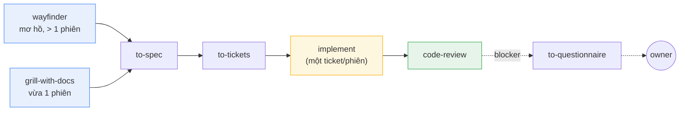
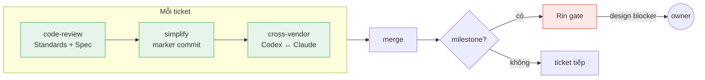

<p align="center">
  <strong>Astragentic</strong><br>
  <em>Quy trình vận hành cho nhiều AI agent cùng ship feature</em>
</p>

<p align="center">
  
  
  
  
</p>

<p align="center">
  <a href="README.md">English</a> ·
  <strong>Tieng Viet</strong>
</p>

---

## Bạn đang dùng AI coding agent, và nó rất tốt — cho một task

Claude Code, Codex, OpenCode — mỗi cái đều mạnh. Bạn giao một ticket, nó implement, bạn
review, merge. Quy trình đơn giản, hoạt động tốt.

Nhưng rồi bạn muốn đi nhanh hơn. Bạn có 10 ticket cho một feature. Bạn spawn 3 subagent
chạy song song, mỗi cái có worktree riêng. Và bạn bắt đầu nhận ra...

**Ai quyết định ticket nào giao cho ai?** Bạn tự dispatch thủ công?

**Agent 1 xong, agent 3 fail giữa chừng, agent 2 vẫn đang chạy.** Ai xử lý? Ai biết?
Subagent chạy ngầm — bạn không thấy nó đang làm gì, đến đâu, hay đã chết từ bao giờ.

**Cả 3 xong. Rồi sao?** Ai review? Theo chuẩn nào? Merge thứ tự nào? Ticket tiếp theo
ai bốc?

**Agent hỏi bạn 5 câu cùng lúc.** Câu đầu trả lời 5 giây. Câu hai phải đào lại PR
history. Câu ba phải nhớ cuộc họp tuần trước. Bạn — owner — trở thành bottleneck của chính
hệ thống mình dựng lên.

Và đây chưa phải toàn bộ vấn đề. Một feature thật không phải chỉ "implement 10 ticket."
Nó đi qua: **grill requirements → spec → cắt ticket → implement → review → merge → QA**.
Đó là vòng đời dài, xuyên nhiều session, có phụ thuộc giữa các bước. Subagent giải quyết
**một bước** trong chuỗi đó. Nó không biết mình đang ở đâu trong pipeline.

**Subagent là worker. Nó không có ý thức về vòng đời.**

---

## Astragentic giải quyết gì

### 1. Vòng đời feature đầy đủ — không phải task đơn lẻ

Claude Code cho bạn agent giỏi. Astragentic cho bạn **quy trình vận hành** để nhiều agent
cùng ship một feature — từ lúc ý tưởng còn mơ hồ đến lúc code chạy trên production.



Công việc vào qua hai cửa tuỳ scope. Cả hai hội tụ vào cùng pipeline:
**spec → ticket → implement → review**. Phương pháp kĩ thuật đến từ
[Matt Pocock's skills](https://github.com/mattpocock/skills) — Astragentic bọc nó bằng
lớp điều phối và mở rộng cho brownfield.

### 2. Nhìn thấy được — không phải black box chạy ngầm

Mỗi agent là một terminal pane trong [herdr](https://github.com/AstralEr/herdr) workspace.
Bạn mở ra thấy ngay:

```
┌─ thomas (router) ─────────────────────────────────────────┐
│ watching frontier · 2 builders active · 1 pending review  │
├─ ticket:TRA-139 (Builder) ──┬─ ticket:TRA-142 (Builder) ─┤
│ implementing auth module     │ waiting: TRA-139 blocking  │
├─ spec:TRA-87 (Shaper) ──────┼─ rin:TRA-125 (Rin) ────────┤
│ grilling requirements        │ reviewing milestone 3      │
├─ qa:TRA-125 (QA) ───────────┘                            │
│ walking login flow                                        │
└───────────────────────────────────────────────────────────┘
```

Không phải mở task manager, không phải hỏi "mày làm đến đâu rồi." Mỗi pane là một card
trên board — bạn nhìn workspace như nhìn Kanban board bằng terminal.

### 3. Giảm tải cho owner — bạn chỉ quyết định tầm owner

Thomas — router thường trú — hiểu project, có context dài hạn. Khi agent hỏi:

- *"Function này nên throw hay return null?"* — Thomas tự quyết dựa trên convention
- *"Scope có bao gồm mobile không?"* — Thomas escalate lên bạn, vì đây là quyết định owner

Bạn không nhận mọi câu hỏi. Bạn chỉ nhận câu hỏi **thực sự cần bạn**.

### 4. Nhiều runtime, tối ưu chi phí — đúng model cho đúng việc

Không phải việc gì cũng cần model đắt nhất. Astragentic cho bạn map trong một file duy nhất:

```markdown
## Active assignments
| Role    | Runtime  | Model           | Effort |
|---------|----------|-----------------|--------|
| thomas  | claude   | claude-opus-5   | medium |  ← cần reasoning sâu
| shaper  | claude   | claude-opus-5   | high   |  ← grill spec quan trọng
| builder | opencode | deepseek-v3     | medium |  ← task rõ, model rẻ OK
| rin     | codex    | codex-default   | medium |  ← vendor khác, tránh bias
| qa      | claude   | claude-sonnet-5 | low    |  ← nhanh là đủ
```

Implement 10 ticket bằng Opus? Cháy túi. Grill spec bằng model rẻ? Spec rác. Orchestrator
cho bạn **chọn đúng chỗ để đầu tư token**.

Và cross-vendor review — Codex review code do Claude viết, hoặc ngược lại — **tránh bias
của cùng một model tự đánh giá chính mình**.

### 5. Issue tracker là nguồn sự thật chung

Agent không track task bằng markdown file chết theo session. Agent dùng **Linear, Jira —
tracker bạn đang dùng hàng ngày**:

- Agent claim ticket trên board — bạn thấy ngay ai đang làm gì
- Agent ghi quyết định vào comment — history sống, không phải terminal log
- Dependency giữa ticket rõ ràng — agent biết cái nào block cái nào
- Session mới mở lên, agent đọc tracker biết ngay phiên trước làm đến đâu

**Người và agent nhìn cùng một board.** Không có hai nguồn sự thật.

---

## Năm vai trò

| Vai trò | Phiên làm việc | Nhiệm vụ |
|---|---|---|
| **Thomas** | thường trú | Điều phối, quản lý frontier, phân phối ticket, lọc quyết định, cross-vendor arm |
| **Shaper** | một phiên liền mạch | Grill yêu cầu, viết spec, cắt ticket — khi toàn bộ bức tranh còn trong context |
| **Builder** | một phiên/ticket | Implement trong worktree riêng — chỉ mình nó ghi ở đó |
| **Rin** | mỗi milestone | Reviewer đối kháng — xác minh cả artifact lẫn dấu vết quy trình |
| **QA** | mỗi walk | Thực hành trên sản phẩm đang chạy — UI, API, dữ liệu thực |

---

## Review — một vòng, ba lớp



Mọi ticket đều qua cả ba lớp — không ngoại lệ. Tại milestone, Rin chạy gate xác minh
artifact và dấu vết quy trình. Blocker tầm design đi thẳng đến owner, không quay thêm
vòng nào.

Hệ thống trước: 5-14 vòng review. Hệ thống này: **1 vòng**.

---

## Skill cho brownfield

Hầu hết agent skill giả định project mới sạch sẽ. Bốn skill này lấp khoảng trống đó:

| Skill | Chức năng |
|---|---|
| `bootstrap-glossary` | Tạo `CONTEXT.md` từ code — mỗi thuật ngữ trích dẫn file nguồn |
| `batch-triage` | Chuyển backlog thừa kế thành ticket có label và quan hệ blocking |
| `legacy-testing` | Sinh characterisation test + tạo seam cho code chưa có test |
| `untangle` | Đường refactor cho code quá rối, vượt quá khả năng tool thông thường |

Nguyên tắc: **trích xuất, không bịa đặt**. Một chuẩn mà code không tuân theo sẽ trở
thành lore mà phiên sau coi như sự thật — nguy hiểm hơn là không có chuẩn.

---

## Bắt đầu nhanh

### Yêu cầu

| Thành phần | Vai trò |
|---|---|
| [**Claude Code CLI**](https://docs.anthropic.com/en/docs/claude-code) | Runtime gốc — mọi vai trò đều chạy được ở đây |
| **Git** (hỗ trợ worktree) | Ranh giới cách ly — mỗi Builder một worktree |
| [**herdr**](https://github.com/AstralEr/herdr) >= 0.8.0 | Quản lý terminal workspace — agent pane, prompt/wait/read |
| [**mattpocock-skills**](https://github.com/mattpocock/skills) >= 1.2.3 | Phương pháp kĩ thuật — wayfinder, grill, spec, ticket, implement, review |

Tuỳ chọn: **Codex CLI** (cross-vendor review), **OpenCode CLI** (runtime thứ ba)

### Cài đặt

```bash
# 1. Kiểm tra máy
./check-requirements.sh

# 2. Stage harness vào repo
./install.sh <target-repo>

# 3. Mở repo trong Claude Code, chạy bộ cài đặt thích ứng
cd <target-repo>
claude "Read .astraler/releases/2.3.7/ADAPT-HARNESS.md completely and execute it."

# 4. Cấu hình orchestrator.md (role → runtime → model → effort)
# 5. Khởi động
claude --agent thomas
```

Thomas đọc orchestrator, nhận workspace, và bắt đầu điều phối.

---

## Tổng quan

| | |
|---|---|
| **Vai trò** | 5 — Thomas, Shaper, Builder, Rin, QA |
| **Skill** | 13+ điều phối, 4 brownfield |
| **Runtime** | Claude Code, Codex, OpenCode |
| **Lớp review** | 3 mỗi ticket · 1 vòng duy nhất |
| **Failure mode** | 109 đo lường được, evidence base chỉ thêm không xoá |
| **Tracker** | Linear, Jira — nguồn sự thật chung giữa người và agent |

---

## Cấu trúc thư mục

```
harness/
  .agents/
    roles/            năm role contract + supplement theo runtime
    orchestrator.md   role → runtime/model/effort (file của bạn)
    skills/           13+ skill — dispatch, review, brownfield, arm
    memory/
      recurring-failure-modes.md
  .claude/
    agents/           Claude adapter (--agent <role>)
    skills/           Skill Claude tự phát hiện
  .opencode/agents/   OpenCode adapter
  .codex/profiles/    Codex role profile
  scripts/            watcher, watchdog, audit, reachability check
docs/adr/             architectural decision record
prompts/ADAPT-HARNESS.md   bộ cài đặt ngữ nghĩa
install.sh            staging script
check-requirements.sh kiểm tra máy
```

## Thuật ngữ

| Từ | Nghĩa |
|---|---|
| **package** | Repo này — tạo ra harness |
| **adapted project** | Repo đã được cài harness vào |
| **payload** | Phần release stage, có thể ghi đè tự do |
| **scaffold** | Cấu hình của owner, viết một lần, không ghi đè (`orchestrator.md`) |
| **frontier** | Tập ticket hiện đang claimable bởi agent |
| **gate** | Checkpoint xác minh — Rin review tại milestone |
| **arm** | Bước review cross-vendor (Codex review code của Claude, hoặc ngược lại) |
