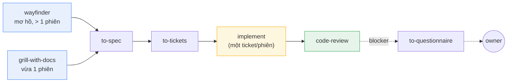
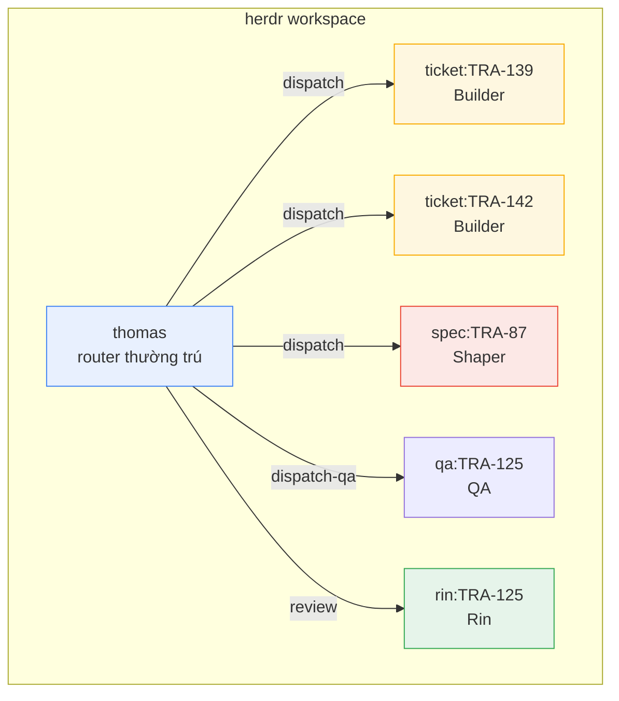
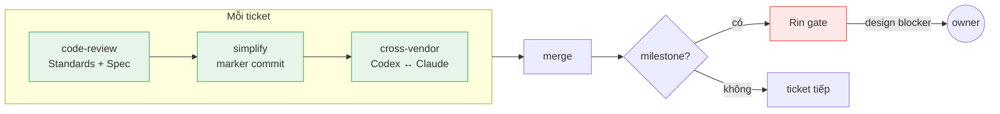

<p align="center">
  <strong>Astragentic</strong><br>
  <em>Điều phối nhiều AI agent cùng làm việc trên codebase thực</em>
</p>

<p align="center">
  
  
  
  
</p>

<p align="center">
  <a href="README.md">English</a> ·
  <strong>Tieng Viet</strong>
</p>

---

AI coding agent rất mạnh khi chạy một mình. Nhưng khi bạn chạy nhiều agent cùng lúc trên
một codebase thực — branch song song, state dùng chung, code legacy — mọi thứ vỡ theo
những cách rất quen thuộc: agent ghi đè lên nhau, review quay vòng 5-14 lần, và không ai
biết thực sự cái gì đã chạy.

**Astragentic là framework điều phối nhiều AI agent cùng xây dựng phần mềm.** Nó xử lý
cách ly môi trường, phân phối task, review code, và truy vết — để bạn có nhiều agent chạy
đồng thời mà không đụng nhau, review xong trong một vòng, và mọi artifact đều chứng minh
được chuyện gì đã xảy ra.

---

## Bắt đầu nhanh

```bash
# 1. Kiểm tra máy có đủ yêu cầu chưa
./check-requirements.sh

# 2. Đưa harness vào project của bạn
./install.sh /path/to/your-repo

# 3. Mở repo trong Claude Code, chạy bộ cài đặt thích ứng
cd /path/to/your-repo
claude "Read .astraler/releases/2.3.0/ADAPT-HARNESS.md completely and execute it."

# 4. Khởi động router
claude --agent thomas
```

Thomas đọc cấu hình orchestrator, nhận workspace, và bắt đầu điều phối công việc.

> **Yêu cầu:** [Claude Code CLI](https://docs.anthropic.com/en/docs/claude-code),
> Git (hỗ trợ worktree),
> [herdr](https://github.com/AstralEr/herdr) >= 0.8.0,
> [mattpocock-skills](https://github.com/mattpocock/skills) plugin >= 1.2.3

---

## Tại sao cần Astragentic

### Agent xung đột khi không có cách ly

Hai agent dùng chung một checkout: agent này chạy `git switch` trong khi agent kia đang
commit. Ba commit rơi vào branch sai và biến mất. **Astragentic cấp cho mỗi Builder một
git worktree riêng** — chúng chia sẻ danh sách ticket nhưng không bao giờ chung checkout.
Chạy song song theo thiết kế, cách ly theo cấu trúc.

### Review quay vòng vô tận khi không có quy trình

Hệ thống trước đo được 5-14 vòng review trên mỗi ticket. Vòng 2 thêm lock, vòng 3 bỏ
lock, vòng 8 vẫn đang dọn dẹp tàn dư của vòng 2. **Astragentic chạy một vòng review duy
nhất, sâu ba lớp** — code-review, simplify pass, cross-vendor arm — rồi xong.

### Code brownfield bị bỏ quên

Hầu hết skill của agent giả định project mới sạch sẽ. Chúng không có khái niệm legacy,
untestable, hay "chuẩn chỉ tồn tại trong đầu mọi người." **Astragentic cung cấp bốn skill
chuyên cho brownfield** — trích xuất kiến thức từ codebase hiện có, không bao giờ bịa ra
thứ chưa có.

### Không ai biết thực sự cái gì đã chạy

Agent báo "xong" — nhưng nó có chạy simplify pass không, hay bỏ qua? Nó dùng đúng tool
hay dùng tool khác tạo ra marker giống hệt? **Astragentic nhúng truy vết vào mọi
artifact** — mỗi commit mang dòng `Pass:` ghi rõ cái gì đã chạy, mỗi gate report có
đường dẫn unique.

---

## Cách hoạt động

### Năm vai trò, ranh giới rõ ràng

| Vai trò | Phiên làm việc | Nhiệm vụ |
|---|---|---|
| **Thomas** | thường trú | Điều phối, quản lý frontier, phân phối ticket, chạy cross-vendor arm |
| **Shaper** | một phiên liền mạch | Grill yêu cầu, viết spec, cắt ticket — khi toàn bộ bức tranh còn trong context |
| **Builder** | một phiên/ticket | Implement trong worktree riêng — chỉ mình nó ghi ở đó |
| **Rin** | mỗi milestone | Reviewer đối kháng — xác minh cả artifact lẫn dấu vết quy trình |
| **QA** | mỗi walk | Thực hành trên sản phẩm đang chạy — UI, API, dữ liệu thực |

### Luồng công việc



Công việc vào qua hai cửa tuỳ phạm vi. Cả hai hội tụ vào cùng một pipeline:
**spec → ticket → implement → review**. Phương pháp kĩ thuật đến từ
[Matt Pocock's skills](https://github.com/mattpocock/skills) — Astragentic bọc nó bằng
lớp điều phối và mở rộng cho brownfield.

### Cấu trúc điều phối



Mỗi Builder có terminal pane và git worktree riêng.
[herdr](https://github.com/AstralEr/herdr) quản lý topology của workspace.

### Review pipeline — một vòng, ba lớp



Mọi ticket đều qua cả ba lớp — không ngoại lệ. Tại milestone, Rin chạy thêm gate xác
minh artifact và dấu vết quy trình. Blocker ở tầm design đi thẳng đến owner, không quay
thêm vòng review nào.

---

## Skill cho brownfield

Bốn skill lấp đầy khoảng trống mà các agent skill thông thường bỏ ngỏ:

| Skill | Chức năng |
|---|---|
| `bootstrap-glossary` | Tạo `CONTEXT.md` từ code — mỗi thuật ngữ trích dẫn file nguồn |
| `batch-triage` | Chuyển backlog thừa kế thành ticket có label và quan hệ blocking |
| `legacy-testing` | Sinh characterisation test + tạo seam cho code chưa có test |
| `untangle` | Đường refactor cho code quá rối, vượt quá khả năng tool kiến trúc thông thường |

Nguyên tắc: **trích xuất, không bịa đặt**. Một chuẩn mà code không tuân theo, hay thuật
ngữ chưa ai xác nhận, sẽ trở thành lore tự tin mà các phiên sau coi như sự thật.

---

## Công nghệ sử dụng

### Bắt buộc

| Thành phần | Vai trò |
|---|---|
| [**Claude Code CLI**](https://docs.anthropic.com/en/docs/claude-code) | Runtime gốc — mọi vai trò đều chạy được ở đây |
| **Git** (hỗ trợ worktree) | Ranh giới cách ly — mỗi Builder một worktree |
| [**herdr**](https://github.com/AstralEr/herdr) >= 0.8.0 | Quản lý terminal workspace — agent pane, prompt/wait/read |
| [**mattpocock-skills**](https://github.com/mattpocock/skills) >= 1.2.3 | Phương pháp kĩ thuật — wayfinder, grill, spec, ticket, implement, review |

### Tuỳ chọn

| Thành phần | Thêm gì |
|---|---|
| **Codex CLI** | Cross-vendor arm — AI thứ hai review mỗi ticket |
| **OpenCode CLI** | Runtime thứ ba cho dispatch |

---

## Cài đặt

### Giai đoạn 1 — Stage

```bash
./check-requirements.sh              # kiểm tra máy
./install.sh <target-repo>           # stage harness vào repo
```

Lệnh này copy harness vào `<target>/.astraler/releases/<version>/`. Không file nào của
project bị sửa. Idempotent — chạy lại không ảnh hưởng gì. Immutable — bản release đã
stage là bản ghi cố định.

### Giai đoạn 2 — Adapt

Mở Claude Code (hoặc Codex) trong target repo:

```
Read .astraler/releases/<version>/ADAPT-HARNESS.md completely and execute it.
```

Agent kiểm tra project, tích hợp harness, chạy brownfield bootstrap nếu cần, và xác minh
mọi thứ bằng artifact.

### Giai đoạn 3 — Cấu hình

Sửa `.agents/orchestrator.md` — file của bạn, không bao giờ bị ghi đè khi nâng cấp:

```markdown
## Workspace identity
| Field | Value |
|---|---|
| workspace-label | `my-project` |

## Active assignments
| Role    | Runtime | Model           | Effort |
|---------|---------|-----------------|--------|
| thomas  | claude  | claude-opus-5   | medium |
| shaper  | claude  | claude-opus-5   | high   |
| builder | claude  | claude-sonnet-5 | medium |
| rin     | claude  | claude-opus-5   | medium |
| qa      | claude  | claude-sonnet-5 | low    |
```

Rồi chạy: `claude --agent thomas`

---

## Tổng quan

| | |
|---|---|
| **Vai trò** | 5 — Thomas, Shaper, Builder, Rin, QA |
| **Skill** | 13+ điều phối, 4 brownfield |
| **Runtime** | Claude Code, Codex, OpenCode |
| **Lớp review** | 3 mỗi ticket (hệ thống cũ: 5-14 vòng) |
| **Failure mode** | 101 đo lường được, evidence base chỉ thêm không xoá |
| **Cách ly** | 1 worktree/Builder, 1 branch/ticket |

---

## Cấu trúc thư mục

```
harness/
  .agents/
    roles/            năm role contract + supplement theo runtime
    orchestrator.md   role -> runtime/model/effort (file của bạn)
    skills/           13+ skill — dispatch, review, brownfield, arm
    memory/
      recurring-failure-modes.md
  .claude/
    agents/           Claude adapter (--agent <role>)
    skills/           Skill Claude tự phát hiện
  .opencode/agents/   OpenCode adapter
  .codex/profiles/    Codex role profile
  scripts/
    herdr-watch-terminal.sh    turn watcher (Codex/OpenCode)
    herdr-watchdog.sh          safety-net, đánh thức Thomas khi pane bị treo
    ticket-git-facts.sh        git state cho tracker
    docs-staleness-audit.sh    word budget, kiểm tra số liệu
    check-reachability.sh      8 check: tồn tại, reachable, addressed
    check-requirements.sh      the doctor
docs/adr/                      architectural decision record
prompts/ADAPT-HARNESS.md       bộ cài đặt ngữ nghĩa
install.sh                     script staging
check-requirements.sh          kiểm tra máy
```

## Thuật ngữ

| Từ | Nghĩa |
|---|---|
| **package** | Repo này — tạo ra harness |
| **adapted project** | Repo đã được cài harness vào |
| **payload** | Phần release stage, có thể ghi đè tự do |
| **scaffold** | Cấu hình của owner, viết một lần, không ghi đè (`orchestrator.md`) |
| **frontier** | Tập ticket hiện đang có thể claim bởi agent |
| **gate** | Checkpoint xác minh — Rin review tại milestone |
| **arm** | Bước review cross-vendor (Codex review code của Claude, hoặc ngược lại) |
